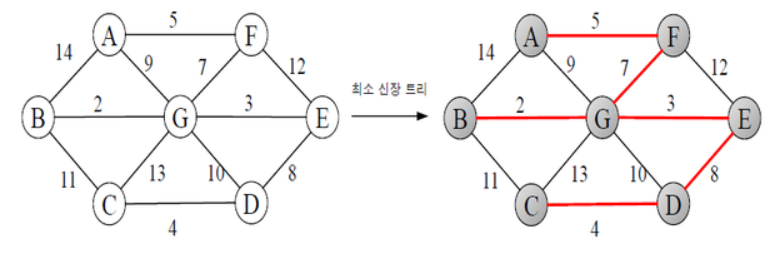

# Minimum Spanning Tree(MST)
최소 신장 트리(Minimum Spanning Tree, MST) 알고리즘은 **무방향 가중치 그래프**에서 **모든 정점을 최소 비용**으로 연결하는 트리 구조의 부분 그래프를 찾는 알고리즘.


### 특징
- 모든 정점을 연결
- 간선의 가중치 합이 최소
- 사이클이 없어야 함

### 사용 예시
1. **네트워크 설계**
    통신망, 전력망, 도로망, 컴퓨터 네트워크 같은 곳에서 모든 지점을 최소 비용으로 연결하는 데 사용됨.
2. **클러스터링**
    MST를 기반으로 데이터 간 연결 구조를 만든 뒤, 큰 가중치를 가진 간선을 끊어서 군집(클러스터)을 분리.
    
## 크루스칼(Kruskal) 알고리즘
그리디 알고리즘을 사용하여 MST를 찾는 알고리즘.
최소 가중치 간선부터 선택하여 트리를 확장하는 방식으로 동작함.

### 동작 과정
1. 모든 간선을 가중치 기준으로 오름차순 정렬.
2. 가중치가 가장 작은 간선부터 선택.
3. 선택한 간선이 사이클을 형성하지 않으면 MST에 포함. 사이클을 형성하면 제외.
4. vertex의 개수가 n개일 때, n-1개의 간선이 선택되면 종료.
   
> 이때 사이클을 확인하기 위해 **유니온-파인드(Union-Find)** 자료구조를 사용함.

### 시간 복잡도
- 간선 정렬 : $O(E log E)$ (E는 간선의 개수)
- Union-Find : 거의 상수 시간
- 최종 시간 복잡도 : $O(E log E)$ 

### 구현 
```java
import java.util.*;

public class KruskalSimple {
    static int[] parent;

    public static void main(String[] args) {
        Scanner sc = new Scanner(System.in);
        int V = sc.nextInt(); // 정점 수
        int E = sc.nextInt(); // 간선 수

        int[][] edges = new int[E][3]; // [from, to, weight]
        for (int i = 0; i < E; i++) {
            edges[i][0] = sc.nextInt();
            edges[i][1] = sc.nextInt();
            edges[i][2] = sc.nextInt();
        }

        // 간선 가중치 기준 정렬
        Arrays.sort(edges, Comparator.comparingInt(a -> a[2]));

        // 유니온 파인드 초기화
        parent = new int[V + 1];
        for (int i = 1; i <= V; i++) parent[i] = i;

        int total = 0;
        int count = 0;

        for (int i = 0; i < E; i++) {
            int a = edges[i][0];
            int b = edges[i][1];
            int w = edges[i][2];

            if (find(a) != find(b)) {
                union(a, b);
                total += w;
                count++;
                if (count == V - 1) break; // MST 완성
            }
        }

        System.out.println("최소 비용: " + total);
    }

    static int find(int x) {
        if (parent[x] != x)
            parent[x] = find(parent[x]); // 경로 압축
        return parent[x];
    }

    static void union(int a, int b) {
        int rootA = find(a);
        int rootB = find(b);
        if (rootA != rootB)
            parent[rootB] = rootA;
    }
}
```

## 프림(Prim) 알고리즘
그리디 알고리즘을 사용하여 MST를 찾는 알고리즘.
정점을 기준으로, 현재 연결된 정점에서 가장 가중치가 작은 간선을 선택하여 트리를 확장하는 방식으로 동작함.

### 동작 과정
1. 임의의 정점에서 시작하여 MST에 포함시킴
2. 현재 MST에 연결 가능한 가장 가중치가 작은 간선을 선택
3. 아직 방문하지 않은 정점이라면 MST에 포함
4. 모든 정점이 포함될 때까지 반복

> 이 과정에서 우선순위 큐(PriorityQueue) 를 사용하여 가장 작은 간선을 빠르게 찾음

### 시간 복잡도
- 우선순위 큐를 사용한 탐색: $O(E \log V)$

### 구현 
```java
import java.util.*;

public class PrimSimple {
    static List<int[]>[] graph;

    public static void main(String[] args) {
        Scanner sc = new Scanner(System.in);
        int V = sc.nextInt(); // 정점 수
        int E = sc.nextInt(); // 간선 수

        graph = new ArrayList[V + 1];
        for (int i = 1; i <= V; i++) graph[i] = new ArrayList<>();

        for (int i = 0; i < E; i++) {
            int a = sc.nextInt();
            int b = sc.nextInt();
            int w = sc.nextInt();
            graph[a].add(new int[]{b, w});
            graph[b].add(new int[]{a, w}); // 무방향 그래프
        }

        boolean[] visited = new boolean[V + 1];
        PriorityQueue<int[]> pq = new PriorityQueue<>(Comparator.comparingInt(a -> a[1]));
        pq.offer(new int[]{1, 0}); // 시작 정점 1

        int total = 0;
        int count = 0;

        while (!pq.isEmpty() && count < V) {
            int[] cur = pq.poll();
            int node = cur[0], weight = cur[1];

            if (visited[node]) continue;

            visited[node] = true;
            total += weight;
            count++;

            for (int[] next : graph[node]) {
                if (!visited[next[0]]) pq.offer(next);
            }
        }

        System.out.println("최소 비용: " + total);
    }
}
```

## 크루스칼 vs 프림
- **크루스칼**: 간선이 적은 경우 유리
- **프림**: 간선 수가 정점 수와 비슷하거나 많은 경우 유리

---
### 문제
1. Union-Find 자료구조의 병목 지점은 어디이고, 그것을 시스템적으로 개선할 수 있을까요?