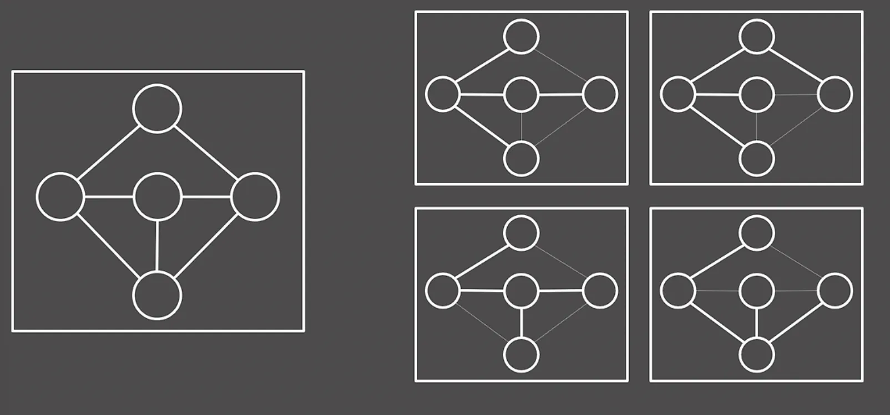
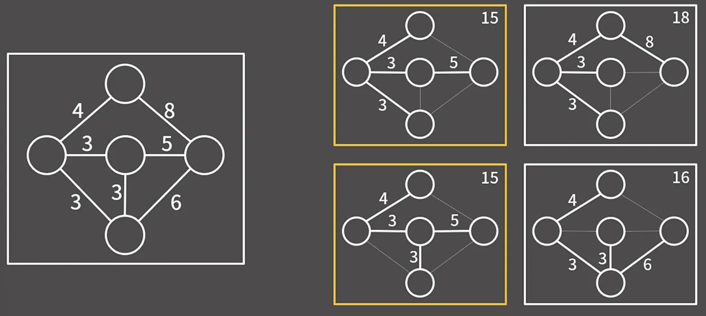

# Minimum Spanning Tree

신장 트리는 무방향 그래프의 부분 그래프들 중에서 모든 정점을 포함하는 트리이다.

사진의 왼쪽 그래프에서 오른쪽 그래프는 모두 신장 트리이다. 신장 트리라 하면 당연히 연결 그래프가 되겠고, 트리이므로 당연히 사이클이 존재해선 안된다.


```java
public class DisjointSet {
    // 부모 노드와 랭크 정보를 함께 저장(음수 값이 랭크 역할)
    static int[] p;

    // 초기화 함수
    public static void initialize(int n) {
        p = new int[n];
        for (int i = 0; i < n; i++) {
            p[i] = -1;  // 초기에는 모든 노드가 각 집합의 루트
        }
    }

    // Find 연산: 경로 압축 적용
    public static int find(int x) {
        if (p[x] < 0)
            return x;
        return p[x] = find(p[x]);  // 경로 압축
    }

    // 두 집합이 다른 그룹인지 확인하고 병합
    public static boolean isDiffGroup(int u, int v) {
        u = find(u);
        v = find(v);
        // 같은 그룹
        if (u == v)
            return false;

        // 현재 u, v는 root이고 p[u]는 u를 루트로 하는 트리의 rank이다.
        if (p[u] == p[v]) // 두 트리의 깊이가 같은 경우 u를 더 깊다고 처리
            p[u]--;
        // u가 더 깊은 경우
        if (p[u] < p[v])
            p[v] = u;
        else
            p[u] = v;
        return true;
    }
}
```

이 정도로 간단하게 알아보고 다시 크루스칼을 구현해 보자.

크루스칼 알고리즘에서는 특정 두 정점이 같은 그룹인지, 다른 그룹인지 판단해야 한다. Union Find를 사용하지 않으면 Flood Fill을 이용해 판단할 수 있다. 현재까지 만든 최소 신장 트리에서 A에서 B로 방문이 가능한지 Flood Fill을 돌렸을 때 방문이 가능하다면 같은 그룹, 아니라면 다른 그룹이다. 하지만 이 경우에 시간복잡도가 O(V+E)가 되고 최대 E번 판단이 필요하므로 O(VE)가 된다.

그렇게 비효율적인가 싶겠지만 Flood Fill 대신 Union Find를 사용하면 상수 시간에 특정 두 정점의 그룹을 판단할 수 있기에 굉장히 효율적으로 구현할 수 있다.

바로 코드로 보자.

```java
import java.util.*;

public class KruskalAlgorithm {
    // 간선 클래스 정의
    static class Edge implements Comparable<Edge> {
        int cost, a, b;

        public Edge(int cost, int a, int b) {
            this.cost = cost;
            this.a = a;
            this.b = b;
        }

        // 비용 기준 오름차순 정렬
        @Override
        public int compareTo(Edge other) {
            return this.cost - other.cost;
        }
    }

    public static void main(String[] args) {
        Scanner sc = new Scanner(System.in);
        int v = sc.nextInt();  // 정점 수
        int e = sc.nextInt();  // 간선 수

        Edge[] edge = new Edge[100500];

        // 간선 입력 받기
        for (int i = 0; i < e; i++) {
            int cost = sc.nextInt();
            int a = sc.nextInt();
            int b = sc.nextInt();
            edge[i] = new Edge(cost, a, b);
        }

        // 비용 기준 정렬
        Arrays.sort(edge, 0, e);

        // DisjointSet 초기화
        DisjointSet.initialize(v);

        int cnt = 0;
        for (int i = 0; i < e; i++) {
            int cost = edge[i].cost;
            int a = edge[i].a;
            int b = edge[i].b;

            if (!DisjointSet.isDiffGroup(a, b)) continue;

            System.out.println(cost + " " + a + " " + b);
            cnt++;

            if (cnt == v - 1) break;
        }
    }
}
```

`is_diff_group` 함수는 특정 두 정점이 같은 그룹인지 다른 그룹인지 판단하는 Union Find 함수이다. 또, 오름차순 정렬 기준은 `compareTo` 메서드를 오버라이딩해서 정의하면 되는데, 리턴값이 양수라면 this를 other보다 뒤에 보내게 된다.

다시 복습하자면 크루스칼 알고리즘은

1. 간선을 가중치 기준으로 오름차순 정렬.
2. 가장 낮은 간선부터 해당 간선이 a부터 b라면 a, b가 같은 그룹인지 판단.
3. 같은 그룹이라면 continue; 아니라면 MST의 간선!

위의 알고리즘 순서대로 구현하면 된다.

---

## 프림 알고리즘

프림 알고리즘은 다음과 같다.

1. 임의의 정점을 선택해 최소 신장 트리에 추가
2. 최소 신장 트리에 포함된 정점과 최소 신장 트리에 포함되지 않은 정점을 연결하는 간선 중 비용이 가장 작은 것을 최소 신장 트리에 추가
3. 최소 신장 트리에 V-1 개의 간선이 추가될 때까지 2번 과정을 반복

방법 자체는 크루스칼과 유사하다. 다만, 정점을 기준으로 선택한다는 차이점이 있다. 알고리즘의 이해 자체는 어렵지 않은데 구현에서 문제가 생긴다. 우선순위 큐를 사용해서 알고리즘을 자세히 한 번 짜보자.

1. 임의의 정점을 선택해 최소 신장 트리에 추가, 해당 정점과 연결된 모든 간선을 우선순위 큐에 추가
2. 우선순위 큐에서 비용이 가장 작은 간선을 선택
3. 만약 해당 간선이 최소 신장 트리에 포함된 두 정점을 연결한다면 continue;
4. 해당 간선이 최소 신장 트리에 포함된 정점 u와 포함되지 않은 정점 v를 연결한다면 해당 간선과 정점 v를 최소 신장 트리에 추가 후 정점 v와 최소 신장 트리에 포함되지 않는 정점을 연결하는 모든 간선을 우선순위 큐에 추가
5. 최소 신장 트리에 V-1 개의 간선이 추가될 때 까지 2, 3, 4번 반복

```java
import java.util.*;

public class PrimAlgorithm {
    // 인접 리스트를 위한 간선 클래스
    static class Edge {
        int cost;
        int vertex;

        public Edge(int cost, int vertex) {
            this.cost = cost;
            this.vertex = vertex;
        }
    }

    // 우선순위 큐를 위한 클래스
    static class PQItem implements Comparable<PQItem> {
        int cost;
        int from;
        int to;

        public PQItem(int cost, int from, int to) {
            this.cost = cost;
            this.from = from;
            this.to = to;
        }

        @Override
        public int compareTo(PQItem other) {
            return this.cost - other.cost;  // 비용 기준 오름차순 정렬
        }
    }

    public static void main(String[] args) {
        Scanner sc = new Scanner(System.in);
        int v = sc.nextInt();  // 정점 수
        int e = sc.nextInt();  // 간선 수

        ArrayList<Edge>[] adj = new ArrayList[10005];
        for (int i = 0; i < 10005; i++) {
            adj[i] = new ArrayList<>();
        }

        boolean[] chk = new boolean[10005];
        int cnt = 0;

        // 간선 입력 받기
        for (int i = 0; i < e; i++) {
            int a = sc.nextInt();
            int b = sc.nextInt();
            int cost = sc.nextInt();
            adj[a].add(new Edge(cost, b));
            adj[b].add(new Edge(cost, a));  // 양방향 그래프라면
        }

        // 우선순위 큐 - 비용 기준 오름차순 정렬
        PriorityQueue<PQItem> pq = new PriorityQueue<>();

        // 시작점 1에서 시작
        chk[1] = true;
        for (Edge nxt : adj[1]) {
            pq.add(new PQItem(nxt.cost, 1, nxt.vertex));
        }

        while (cnt < v-1) {
            PQItem current = pq.poll();
            int cost = current.cost;
            int a = current.from;
            int b = current.to;

            if (chk[b]) continue;

            System.out.println(cost + " " + a + " " + b);
            chk[b] = true;
            cnt++;

            for (Edge nxt : adj[b]) {
                if (!chk[nxt.vertex]) {
                    pq.add(new PQItem(nxt.cost, b, nxt.vertex));
                }
            }
        }
    }
}
```

우선순위 큐에 익숙하다면 코드의 이해는 어렵지 않다. 알고리즘을 생각했던 대로 구현하면 된다.

우선순위 큐에서 삽입, 삭제는 O(log E) 이므로 프림 알고리즘의 시간 복잡도는 O(E log E)가 된다. 크루스칼보다 빠르게 MST를 구할 수 있지만 구현이 꽤나 까다롭다. 둘 다 익혀두고 생각나는 대로 써먹는 방식이 좋을 것 같다.
