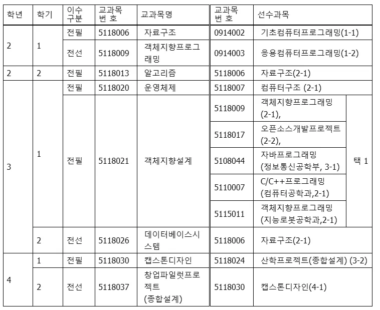
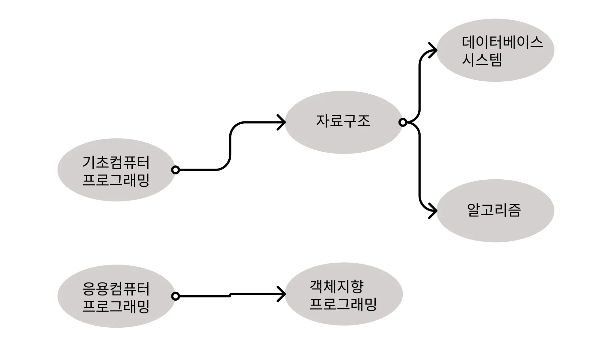
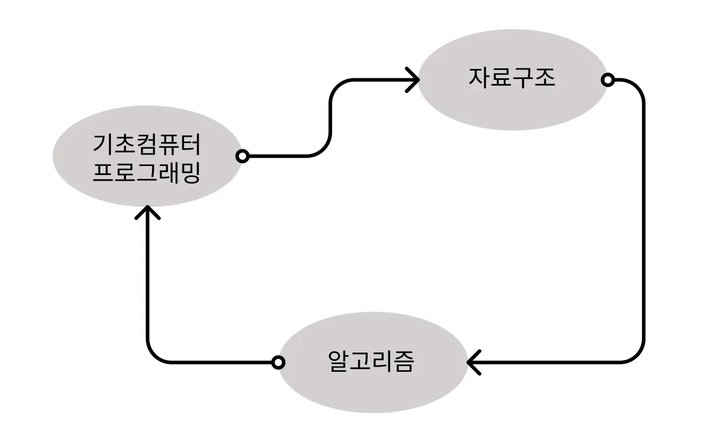
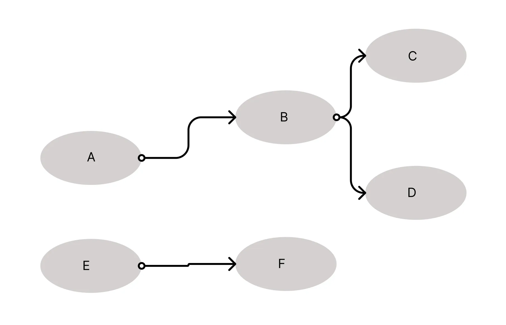

# 위상 정렬

위상 정렬이란 방향 그래프에서 간선으로 주어진 정점 간 선후관계를 위배하지 않도록 정렬하는 방법이다. 대표적인 예시로 교과 이수 제도가 있다. 선수 과목을 다 들어야 다음 과목을 이수할 수 있다는 것인데, 이 선수과목이 서로 겹치는 경우가 있다.
이게 실제 선수과목인데 이를 트리로 나타내보자. A -> B라면 A를 듣고 나서 B를 들어야 한다는 의미로 그려보았다.

복잡한 부분만 나타내면 이렇게 될 텐데, 수강할 수 있는 경우의 수를 생각해 보자.

1. 기초컴퓨터 프로그래밍 -> 자료구조 -> 데이터베이스시스템 -> 알고리즘 -> 응용컴퓨터 프로그래밍 -> 객체지향 프로그래밍
2. 기초컴퓨터 프로그래밍 -> 응용컴퓨터 프로그래밍 -> 객체지향 프로그래밍 -> 자료구조 -> 데이터베이스시스템 -> 알고리즘
3. 등등...

이런 식으로 간선의 선후관계를 지키면서 정렬하는 방식이 위상 정렬이다.

그런데 방향 그래프에서 사이클이 있는 경우는 어떻게 될까?

데드락이 발생한다. 자료구조는 기초컴퓨터 프로그래밍을 요구하고, 알고리즘은 자료구조를 요구하는데 기초컴퓨터 프로그래밍이 알고리즘을 요구하면서 선후관계를 파악할 수 없게 되는 것이다. 따라서 위상 정렬은 사이클이 없는 방향 그래프에서만 동작할 수 있다.

이를 구현하려면 어떤 알고리즘을 짜야할까? indegree를 이용하면 될 것 같은데, indegree는 쉽게 말해 자기에게 들어오는 간선의 수이다.

다시 이 예시에서 indegree를 생각해 보면, 순서대로 "0, 1, 1, 1, 0, 1"이다. 위상 정렬의 첫 원소 후보는 indegree가 0인 노드가 된다. 선후관계에서 선관계가 없다는 뜻이고 가장 먼저 이수해도 되는 교과목이라 생각하면 된다.

만약 A를 시작 노드로 했다면 A와 A에서 뻗어나가는 간선은 없는 셈 쳐도 된다. A와 연결된 노드는 A를 이미 방문했으므로 이제 방문할 준비가 된 것이다. 따라서 A를 방문한 후  B와 E는 같은 선후관계를 가지게 된다.

즉, indegree가 0인 노드를 방문하고, 방문한 노드에서 뻗어나가는 간선을 제거한다. 간선이 제거되면서 A의 자식 노드의 indegree는 1 감소되면서 indegree가 업데이트된다. 업데이트된 indegree를 바탕으로 다음에 방문할 노드를 판단할 수 있는데 indegree의 값이 0이면 방문할 수 있는 것이다.

이걸 바로 구현하려면 딱 규칙대로 간선과 정점을 지우고, indegree가 0인 정점을 찾는 과정을 매 단계마다 수행하면 O(N^2)에 동작한다. 그런데 두 가지 성질을 잡아낸다면 O(V+E)만에 효율적으로 구현할 수 있다.

1. 정점과 간선을 실제로 지울 필요 없이 indegree의 값을 저장해 뒀다가 노드를 방문하면 업데이트하면 된다. 방문한 노드의 자식 노드의 indegree 값을 1 감소시키라는 뜻이다.
2. 특정 노드를 방문하고 indegree 리스트를 업데이트하면 기존에 존재하던 노드를 제외하면 업데이트된 노드만 indegree가 0이 될 수 있다. 즉, 초반에 indegree가 0인 노드들을 큐던 스택이던 배열이던 어디 저장해 두고 하나씩 꺼내면서 방문하고, 그 방문 때문에 indegree 값이 바뀌는 노드의 indegree 값만 체크하면 된다.

이 방식대로 그대로 구현하면 되는데, 구현하는 김에 문제도 하나 풀어보자.

https://www.acmicpc.net/problem/2252

문제를 읽어보면 A B로 입력이 주어지면 A가 B보다 앞에 나와야 하는 것이므로 A -> B로 간선을 두면 되고, 그대로 위상 정렬을 수행하면 된다.

```java
import java.util.*;

/* 위상정렬 2252 줄 세우기 */
public class Main {
    static ArrayList<Integer>[] adj;
    static int[] degree;
    static int n, m;

    public static void main(String[] args) {
        Scanner sc = new Scanner(System.in);

        n = sc.nextInt();
        m = sc.nextInt();

        adj = new ArrayList[32001];
        degree = new int[32001];

        for (int i = 1; i <= n; i++) {
            adj[i] = new ArrayList<>();
        }

        for (int i = 0; i < m; i++) {
            int a = sc.nextInt();
            int b = sc.nextInt();
            adj[a].add(b);
            degree[b]++;
        }

        Queue<Integer> q = new LinkedList<>();

        for (int i = 1; i <= n; i++) {
            if (degree[i] == 0)
                q.add(i);
        }

        while (!q.isEmpty()) {
            int cur = q.poll();
            System.out.print(cur + " ");

            for (int next : adj[cur]) {
                degree[next]--;
                if (degree[next] == 0)
                    q.add(next);
            }
        }

        sc.close();
    }
}
```

바로 코드를 봐도 될 것 같다. 떠오르는 대로 구현하면 효율적으로 작동하고 써먹을 일도 많을 것 같다.

이렇게 위상 정렬을 공부해 봤는데 위상 정렬은 사이클이 없는 방향 그래프에서만 동작한다고 배웠다. 그렇다면 위상 정렬이 안되면 사이클이 존재하는 것 아닐까?

### 위상 정렬을 통한 사이클 판단

정답이다! 위상 정렬을 통해서 사이클의 유무를 판단할 수 있다.

귀류법으로 증명해 보면 사이클이 없는 방향 그래프에서는 매 단계마다 indegree가 0인 정점이 항상 존재한다. 반대로 말하면 사이클이 존재한다면 indegree가 0인 정점이 존재하지 않을 수 있다는 것이고, 따라서 위상 정렬이 끝나도 결과에 포함되지 않는 정점이 존재하게 된다.

즉, 위상 정렬의 결과가 모든 정점을 포함하지 않으면 사이클이 존재하는 것이다.
