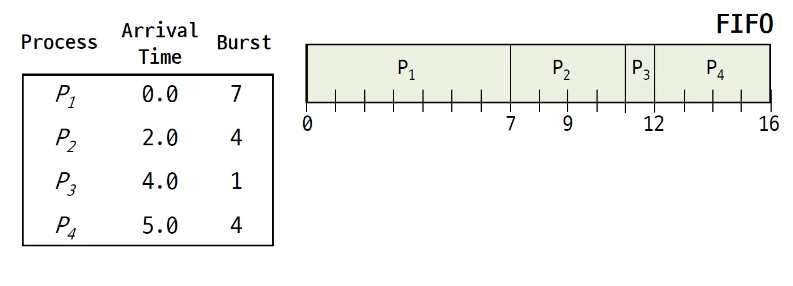
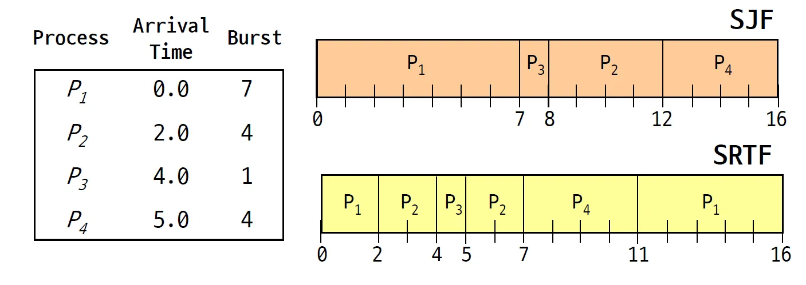
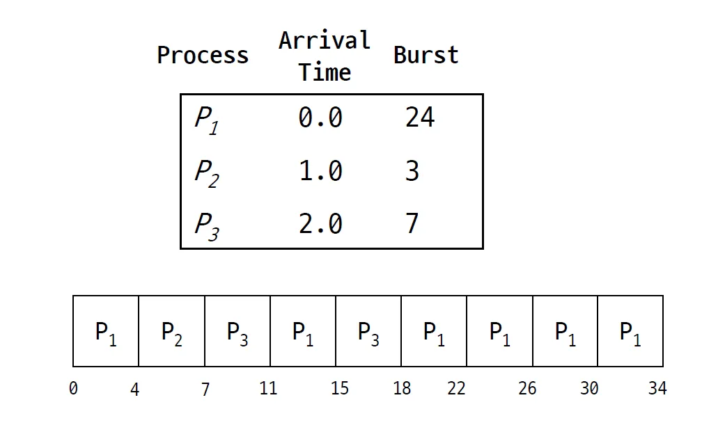
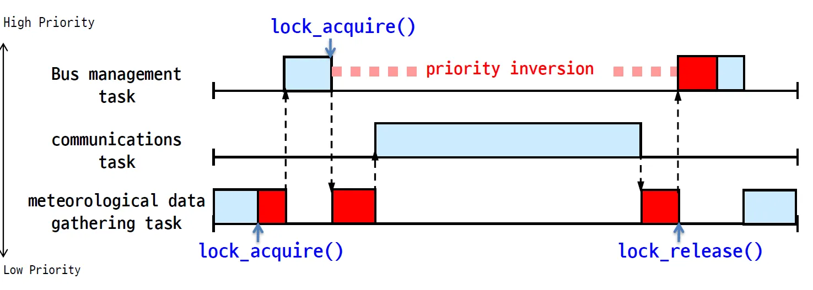
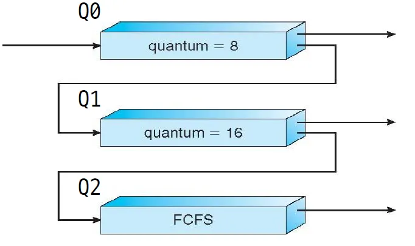

## 1. CPU Scheduling

- **ready 상태에 있는 프로세스 중 다음에 실행할 프로세스 하나를 뽑는 문제이다**.
- 컨텍스트 스위치가 많이 일어나므로 CPU 스케줄러가 자주 일어나고, 그만큼 스케줄링이 빠르게 일어나야 한다.

### Scheduling algorithm goals

All systems

- **굶어죽는 프로세스가 있어서는 안된다**. CPU를 계속 안받는 일이 일어나면 안되고 골고루 받아야 한다는 말이다.
- 어떤 얘는 1초만 쓰고, 어떤 얘는 10초만 쓰면 **공평하지 않다**.
- **밸런스**도 생각해야 한다. 전체 시스템 파트, CPU 메모리 I/O가 골고루 바쁘게 돌 수 있도록 밸런스 있게 스케줄링 하면 좋다.
  밸런스를 고려하지 않는것은 I/O때문에 block되어있는 프로세스에게는 CPU 스케줄링을 하지 않는 것이다. 다른 프로세스에게 줘야지만 I/O도 바쁘고 CPU도 바쁘다.

Batch systems

- Batch systems은 **throughput**이 중요하다. 이를 최대화 시키는 스케줄링 알고리즘을 만들어야 한다.
  - throughput은 시간당 작업량이다.
- 실행과 종료 사이의 시간이 최소화되어야 한다.
- CPU 사용률이 최대한 높으면 좋다.

Interactive systems (스마트폰, 패드 등)

- **response time**이 중요하다.

real-time system (드론 등)

- **deadline**을 잘 지켜야 한다. CPU가 바빠서 사용자의 명령을 무시는 상황이 생기면 안 된다는 뜻이다.
- 예측이 불가능하면 안 된다. 영화를 보는데, 넷플릭스 프로세스에게 CPU를 할당지 못할 것 같으면 그런걸 예상해야 한다.

정리하자면, 각 시스템마다 목표하는 스케줄링 알고리즘이 다르다.

### Starvation

- Starvation은 한 프로세스가 다른 프로세스가 요구하는 자원때문에 progress를 만들지 못하는 상황이다.
  - lock, 우선순위가 많이 밀리는 등의 이유로 실행을 못하는 프로세스는 있어선 안된다.
- 잘못된 스케줄링은 starvation을 만들 수 있다. 대부분은 누가 lock을 잡고 있으면 아무리 CPU를 많이 받아도 사용하지 못하는 이유 때문이다.
- 대부분 동기화 문제때문에 Starvation이 생기는 경우가 많다.

### Non-preemptive & Preemptive

스케줄링은 크게 두 개로 나뉜다.

**Non-preemptive**

프로세스가 끝나거나 CPU를 다시 줄 떄 까지 CPU를 뺏는 일이 없다. 따라서 Jobs가 cooperative해야 한다.

**Preemptive**

스케줄러가 권한이 높아서 CPU를 뺏을 수 있고 컨텍스트 스위치를 강제할 수 있다.

프로세스가 공유된 데이터를 업데이트 하다가 뺏기거나, 시스템 콜의 프로세스가 뺏기는 등 조금 문제가 생길 수 있는데 스케줄링 알고리즘은 이런걸 다 고려해야 한다.

---

## 2. FCFS/FIFO

말 그대로 큐이다. 프로세스가 ready queue가 도착한 순서대로 실행시켜 주는 것이다. 얘는 보통 non-preemptive 방식으로 돌린다. 모든 job을 동등하게 대하고 당연히 starvation이 없다.

그러나 평균 대기 시간이 길어질 수 있다. CPU를 1초 쓰는 프로세스를 빨리 처리하고 10초 쓰는 프로세스를 실행하는게 더 효율적일 수 있다.

그리고 CPU와 I/O가 겹칠 가능성이 높다. 한 번 할당받은 프로세스는 그걸 끝낼 때 까지 CPU를 놓지 않으므로 CPU와 I/O가 overlap 가능성이 높다.

---

## 3. SJF & SRTF

**SJF**, Shortest Job First 알고리즘도 있다.

CPU 사용 시간이 가장 짧을 것으로 예상되는 job에게 먼저 CPU를 할당한다. 이 알고리즘은 평균 waiting time이 가장 적은 것으로 증명되어 있다. non-preemptive 방식이다.

하지만 **CPU를 누가 가장 짧게 쓸지 판단할 수 없다**. 완벽하게 예측할 순 없지만 추측이라도는 해볼 수 있다고 쳐도, **starvation이 생길 수 있다**. CPU burst가 1초로 짧은 얘가 계속 들어오면 burst가 3초짜리인 job은 실행이 불가능하다.

**SRTF**, Shortest Remaining Time First

SJF의 **Preemptive** 버전이다. 적절한 시점이 되면 컨텍스트 스위치를 시킨다. 적절한 시점이란, **새로운 프로세스가 waiting 큐에 도착**하는 시점을 말한다.

---

## 4. Round Robin (RR)

- FIFO의 preemptive 방식인데, time sharing 방식에 굉장히 좋다.
- job을 time slice(quantum)로 쪼개고, time slice에 따라 preemptive하게 큐를 time slice만큼 CPU를 할당하는 방식이다.
- FIFO이므로 starvation은 일어나지 않는다.
- SJF보다는 turnaround time이 좋지 않을 수 있지만 response time은 좋을 수 있다.
- time slice를 얼마나 줘야할까?
  - 쉽게 생각해 보면 time slice가 짧으면 짧을수록 response time이 작아지고 부드럽게 동시에 돌아가는 것처럼 보인다.
  - time slice가 길면 context switch가 적게 일어나서 전체적인 throughput은 적어진다.
  - SJF를 생각해보면 context switch는 적게 일어나서 좋지만 starvation을 고려해야 한다. SRTF는 context switch가 빈번히 일어난다. time slice가 짧아지면 사용자 입장에서 부드럽게 도는 것 처럼 느껴지겠지만 실제 전체 시간은 늘어나는 것이다.
- time slice를 CPU bursts의 80%로 하면 좋을 것 같다는 의견도 많지만 실제로는 상황마다 정말 다르다. 실제 UNIX에서 조금 다르긴 하지만 사용된다.

---

## 5. Priority scheduling

- 실제로는 우선순위 + RR 알고리즘을 합쳐서 사용한다.
- **가장 높은 우선순위를 가지는 프로세스를 다음에 돌리는 방식이다.**
- 보통 숫자가 낮을수록 우선순위가 높다.
- SJF도 사실은 우선순위 알고리즘의 일종이다. SJF의 우선순위가 남은 시간이 적은게 되는거고 RR, FIFO도 먼저 도착하는게 우선순위가 되는 것이다.
  - 사실 보는 관점에 따라 RR, FIFO는 우선순위가 아닐 수 있다. 중간에 우선순위가 바뀌는 일이 없기 때문이다.
- 우선순위 또한 preemptive, non-preemptive를 가질 수 있다.
- 보통 우선순위는 dynamically하다.
- 보통은 Multi-level Feedback Queue를 사용해서 구현한다.

### Starvation → Aging

우선순위 스케줄링에선 항상 Starvation 문제를 고려해야 한다. SJF에서는 CPU burst가 짧은 프로세스만 계속 들어오면 긴 프로세스는 선택받지 못하는 상황이 생길 수 있고 우선순위 스케줄링도 마찬가지이다.

이는 **Aging**으로 해결한다. wait queue에 머무르는 시간이 긴 프로세스는 우선순위를 높여서 좀 더 선택받을 가능성을 높일 수 있다.

반대로 어떤 프로세스가 CPU time을 많이 쓰면 우선순위를 낮출 수 있다.

위의 두 방법 중 하나만 사용할 수 있고 둘 다 사용할 수 있다. 물론 이게 제일 좋은 방법인지는 모른다.

### Priority inversion problem

또 다른 문제로, Priority inversion problem이 있다. 높은 우선순위를 가지는 task와 낮은 우선순위를 가지는 task가 있으면 당연하게도 높은 우선순위를 가지는 프로세스가 돌아야 하는데, lcok같은 것들 때문에 우선순위가 낮은 프로세스가 돈다.

이럼 정말 큰 문제가 생기는데, 우선순위가 높은 프로세스는 높은 우선순위때문에 CPU를 계속 받아도 낮은 프로세스가 lock을 잡고 있어서 CPU를 받아도 못쓴다. 우선순위가 낮은 프로세스는 lock 부분을 빨리 실행해야하는데 CPU를 못받는다.

예시를 보면 bus management task가 lock때문에 한참동안 실행을 못한다. priority inversion이 일어나는 것이다. 이 문제를 해결하려면 두 가지 방법이 있다.

**PIP**

우선순위가 높은 job은 낮은 job에게 자신의 우선순위를 잠시 빌려줄 수 있다. 그럼 lock 부분을 빨리 깨고 나올 수 있다.

**PCP**

우선순위가 낮은 job을 순간적으로 가장 우선순위가 높게 만들어준다. ceiling value, 가장 우선순위가 높게 설정하는 값은 미리 정해놔야 한다.

### Multilevel Feedback Queue

우선순위 스케줄링은 **Multilevel Feedback Queue**를 사용해서 구현한다.

Multilevel Queue는 **여러 큐를 사용해서 위쪽에 있는 큐는 높은 우선순위를 가지는 것**이다. 위쪽에있는 큐부터 FIFO로 하나씩 뽑아서 프로세스를 실행한다. 이럼 자연스럽게 우선순위가 구현된다.

어떤 프로세스가 CPU를 너무 많이 쓰면 더 낮은 큐로 옮겨서 **aging을 사용**할 수 있다. 이게 **feedback을 주는 것**이고 따라서 multilevel feedback queue라 하는 것이다.

어떤 우선순위가 낮은 프로세스가 큐에 너무 오래 있다면 높은 우선순위 큐쪽으로 옮겨줄 수 있다. 그럼 **starvation을 막을 수 있다.**

예시를 보면, Q0는 time quantum 8을 쓰는 RR, Q1은 time quantum 16을 쓰는 RR, Q3는 FCFS를 사용한다고 생각해보자.

Q0, Q1의 time quantum이 다른 이유는 아마 설계자가 Q0에서 끝내지 못한 프로세스는 Q1으로 옮겨지므로 거기서 다 끝내라는 의도일 것이다.

즉, 짧게 시간을 줘서 끝낼 수 있으면 끝내고(Q0) 조금 더 길게 시간을 줘서 끝내게 유도하고(Q1), 반드시 끝나게(Q2) 하는 것이다. 실제로는 우선순위 + RR을 쓰고, 예시처럼 Q0에서 다 끝나지 않은 프로세스가 Q1으로 이동하지는 않는다.

---

## 7. UNIX Scheduler

UNIX 스케줄러를 알아보자.

**Preemptive, Priority-bas**e로 되어 있다. 항상 우선순위가 가장 높은 프로세스가 CPU를 받을 수 있다. UNIX에서는 170, Linux에서는 40개의 우선순위 레벨이 나눠져있다. **Time sharing 방식의 RR도 사용한다**. 리눅스는 timeslice 값을 내부 스케줄러에 따라 조정되도록 설계되어있다. MLFQ로 구현되어 있다.
