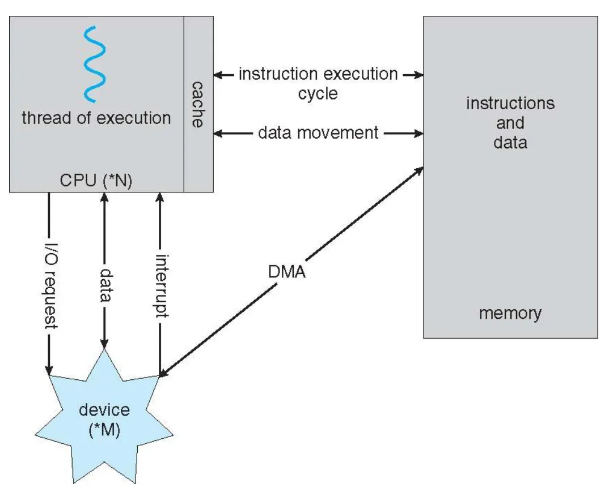

## 1. OS Internals

운영체제는 커널로 명령어를 처리한다. 커널은 하드웨어와 소프트웨어 간의 인터페이스 역할을 하며, 시스템의 리소스를 관리하고 프로세스 간의 통신을 관리한다.

또, 운영체제는 애플리케이션과 System Call Interface로 통신한다. 애플리케이션 계층을 User space, 커널 부분을 Kernel space라 한다. 디바이스(하드웨어) 별로 어떤 드라이브가 필요한지 등의 정보를 Kernel space의 Arch-dependent kernel code가 관리한다.

시스템 콜 인터페이스와 커널은 운영체제의 다른 부분이며 다른 역할을 한다. 어플리케이션이 운영체제를 호출할 수 있는 인터페이스로서의 역할을 하는 것이다.

커널은 시스템 콜을 수신하고 해당 요청을 처리하여 하드웨어와 상호작용한다. 커널은 운영체제의 핵심으로 운영체제의 다른 구성 요소들과 상호작용하며 전반적인 시스템 동작을 관리한다.

---

## 2. I/O의 과정과 하드웨어와의 상호작용

컴퓨터는 CPUdisk controller 등 I/O controller/ memory가 있고, 이들은 하나의 버스로 연결되어 있다. 이 방식에서 중요한 점은 I/O 장치와 CPU는 독립적으로 동작한다는 것이다.

각 device controller는 특정 디바이스가 어떻게 동작하는지를 총괄하고, 각각의 컨트롤러는 메모리 버퍼를 가지고 있다. CPU는 main memory와 컨트롤러의 local buffers 사이에서 서로 데이터를 주고받는데, 이런 과정을 I/O라 한다. 그런데 CPU와 I/O device 처리 속도는 매우 다르다. 따라서 CPU는 I/O device에 명령을 주었을 때 끝날 때까지 대기하는 게 아닌 다른 일을 하고 I/O 장치의 일이 끝났는지 알 수 있는 방법이 있어야 한다.

---

## 3. Interrupts

하드웨어에서 운영체제에 요청하는 것이다. 하드웨어가 요청할 일이 있으면 cpu에 특정한 핀에 신호를 주는 방식으로 작동한다. 아까 얘기했던 I/O 장치의 일이 끝났는지 아는 방법은 크게 2개가 있다.

### **Polling**

I/O 장치에 CPU가 계속 물어보는 방식이다. Disk controller에게 계속 물어보는건데 이 방식은 CPU 사용률이 매우 높다.

### **Hardware interrupt**

I/O 장치가 끝나면 보고하는 방식이다. CPU는 Disk controller에게 `*어느 영역에서 얼마 만큼의 데이터를 읽어줘*`라고 명령을 한 후 다른 일을 한다. Disk controller는 다 읽으면 Interrupt controller에게 알려주고 CPU는 메모리에서 읽어온다. 이런 I/O controller는 CPU와 별개의 하드웨어이고 읽어온걸 메인 메모리에 쓰는 역할을 한다.

위의 두 방식으로 인터럽트를 받으면 커널이 뭔가 핸들링해서 응답해줘야 한다. 이를 **Interrupt handling**이라 한다.

### **Interrupt handling**

1. CPU가 다른 애플리케이션의 명령을 수행하다가 인터럽트가 들어오면 애플리케이션 코드를 정지시키고 커널 코드로 바꾼다.
2. CPU의 현재 상태를 보존한다. 프로세스 테이블이라는 특별히 정해진 공간에 모두 저장하는 방식이다.
3. 운영체제 코드가 넘어오면 인터럽트가 누구에게, 왜 왔는지 확인한다.
4. 인터럽트 테이블에서 있는데 몇 번 인터럽트인지 확인하고 Interrupt Service Routine(Interrupt Handler)에 적혀있는 대로 처리한다. ISR은 운영체제의 코드로 인터럽트가 들어오면 확인해서 운영체제에 정해진 로직대로 처리하는 코드이다.
5. ISR이 다 끝나면 다시 돌아가서 실행하던 어플리케이션을 실행한다.

---

## 4. Exceptions

### **Traps**

어플리케이션이 의도적으로 운영체제에게 요청하는 것이다. **System call**이 대표적이고 breakpoint, special instructions도 여기에 해당한다. `fork()`, `fopen()` 등 애플리케이션이 운영체제의 기능을 사용할 수 있도록 만들어져 있는 인터페이스이다. System call에 대해 더 알아보자.

### **Traps - System call**

`scp a.txt b.txt` 같은 명령어를 실행시키면 input file을 open 할꺼고 output file을 create 해야 한다.

그다음부턴 loop를 돌면서 input에서 읽고 output에 쓰다. 이 과정을 read가 fail 할 때까지 반복하게 된다.

과정이 끝나면 close output file, 화면에 성공메시지 쓰기, 종료하기의 과정을 거칠 텐데 이것들 모두가 system call에 해당한다.

**system call이 어떻게 동작하냐면 user application을 실행하다가 fopen을 보고 system call이라고 판단한 후 system call inteface에 요청한다.**

**요청하면서 trap이 발생하고, kernel mode로 전환되면서 CPU가 커널 코드를 실행한다.**

**커널 코드는 System call table을 뒤지기 시작한다. 거기서 원하는 함수를 찾으면 function pointer가 되어있어서 운영체제 내부로 function pointer를 따라가서 실행한다.**

**다 끝나면 system call interface에 리턴한다.**

리눅스, window 모두 system call 명령어를 제공한다. fork, kill, open 등등등… system call은 운영체제가 쓰라고 제공하는 것이다. 어떤 파일을 열어라 같은 함수로 운영체제가 제공하는 서비스 함수이다.

### **Faults**

대부분 문제가 있어서 발생하고 해결이 가능하다. Page faults(페이지 테이블에서 데이터가 캐시에 없어서 disk까지 내려가야 하는 상황, 따라서 운영체제가 해결이 가능하다), protection faults를 포인터로 건드려서 프로그램이 죽는 등의 상황들이 faults에 해당한다. 참고로 읽을 수 없는 파일을 읽어는 경우 등은 운영체제가 해결할 수는 없지만 사용자에게 알려줄 수는 있다

### Aborts

의도하지도 않았고 회복도 불가능한 문제이다. 프로그램을 없애야 전체 시스템을 보호할 수 있다.

---

## 5. Signals

웹 서버 프로세스가 네트워크 패킷을 기다리고 있다면 운영체제는 패킷 interrupt를 받아서 프로세스에게 알려줘야 한다. 이처럼 **프로세스에게 운 영체제가 뭔가 알려줘야하는 상황에 보내는 요청을 signal**이라 한다.

singals는 비동기적이다. 아무때나 Asynchronous 하게 보낸다. 우리가 Ctrl + c를 누르면 무엇을 실행하고 있던 운영체제는 프로세스에게 kill을 줘서 종료시킨다.

시그널의 작동 과정을 알아보자.

1. 타겟 프로세스를 멈춘다.
2. 프로세스에게 시그널을 전달한다.
3. 프로세스는 시그널을 받아서 미리 정의해 둔 시그널이라면 시그널에 맞는 시그널 핸들러를 불러서 실행한다.
   - 정의되지 않은 시그널이라면 디폴트로 정의된 시그널 핸들러를 실행시킨다.

시그널은 인터럽트와 비슷하게 밑에서 위로 올라가지만 인터럽트는 하드웨어에 의해 발생하고 커널이 처리한다. 시그널은 커널에 의해 발생하고 처리는 각각의 프로그래머가 정의한 핸들러에 의해 처리된다는 차이점이 있다.

---

## 6. DMA

I/O 컨트롤러 내부에 조그마한 버퍼 메모리가 있다. 그 버퍼 메모리에서 메인 메모리쪽으로 복사사키는걸 input, 반대를 output이라 한다. 이러한 과정, I/O에서 데이터를 전송하는 방식은 Programmed I/O와 DMA 방식이 있다.

**Programmed I/O**

- **데이터를 옮기는 작업을 CPU가 관여한다**. 특별한 I/O instruction(protected instruction) 방법이 있고 memory-mapped 방법도 있다.
- I/O 작업때문에 CPU가 묶여있기에 비효율적일 수 있다.
- Programmed I/O 방식은 전송 데이터 양이 적을때 사용한다. 키보드에서 1byte만 옮기는 상황이라면 CPU가 빨리 복사해서 옮기는게 더 낫다.

**DMA**

- **I/O 장치가 직접 옮긴다.**
- DMA란 Direct Memory Access의 약자로 직접 메모리에 접근하는 것이다.
- DMA인터럽트가 오면 프로세스를 멈추고 현재 context를 보존하고 인터럽트를 커널 코드로 바꿔서 테이블을 뒤져보고 핸들러를 호출한다.
- DMA는 보통 high-speed I/O를 요구하거나 전송 데이터 양이 많을 때 사용한다. DMA는 인터럽트를 처리하는 등의 과정이 많이 필요한데 전송 데이터 양이 많다면 이 과정들을 감안하고도 더 빠르기 때문이다.
- DMA는 보통 그래픽카드처럼 빠른 장치가 옮기는데 CPU는 I/O 장치에게 4GB만큼 메모리에 채워줘~ 이런 하나의 명령만 한다. 작업이 종료되면 CPU에게 인터럽트를 건다. CPU는 데이터를 옮기라는 명령만 주고 데이터를 옮기는 **동작에는 전혀 관여하지 않는 것이다**.

## 

---

## 7. Timers

CPU는 time-sharing 방식으로 a.exe, b.exe, c.exe의 instruction을 한줄씩 돌면서 실행한다. CPU는 a.exe → b.exe 처럼 현재 실행하는 명령어를 언제 바꿀 수 있을까?

CPU가 a.exe를 실행시키고 있으면 운영체제가 중간에 멈출 수 없다.

따라서 **hardware timer**가 필요하다.

timer는 메인보드에 들어있고 일정 주기마다 인터럽트를 쏴준다. 인터럽트를 받으면 잠시 CPU가 멈추므로 그때 운영체제 코드가 CPU를 돌면서 a.exe가 시간을 많이 썼으므로 b.exe로 변경하는 방식으로 실행중인 프로세스를 변경한다. 이를 **context-switch**라 한다. 타이머를 통해 어떤 프로그램을 돌릴지 정할 수 있는 것이다. 타이머 주기는 CPU 스케줄링에 굉장히 중요하다.

타이머를 건드리는 일은, 타이머를 늦춘다거나 타이머 인터럽트를 어떻게 한다던가 하는 일은 운영체제 코드만 가능하다. 즉 권한이 필요하다.
