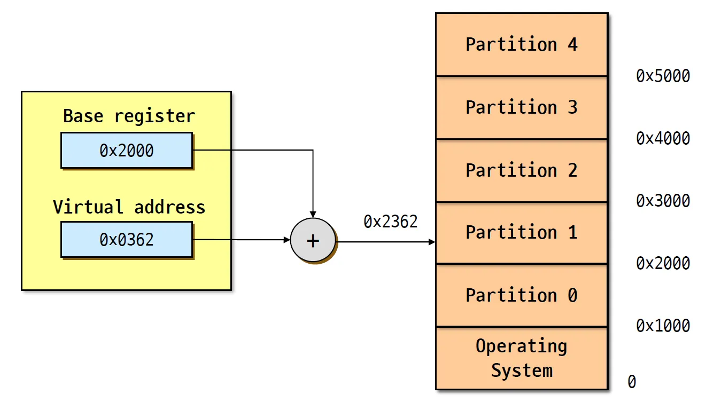
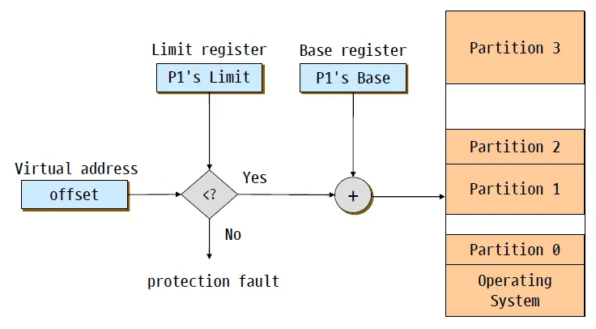

## 1. Memory Management

### 운영체제가 어떤 방식으로 피지컬한 메모리를 관리할까?

메모리 관리의 목적은 다음과 같다.

- **프로그래머에게 abstract view를 보여주는게** 중요하다.
- 메모리는 부족한 자원인데, 이를 **잘 나눠줘야 한다**.
- 프로세스간 **isolation을 제공**해야 한다.

### 메모리 관리는 아래의 요구사항을 만족시켜야 한다.

- **Protection** : 스택은 얼마나 쓸 수 있어야한다던지, 코드의 영역은 어디부터 어디까지인지 등을 제한해야 한다.
- **Fast translation** : 가상 주소를 물리 주소로 변환하는 일은 굉장히 많다. 그 과정이 빨라야 한다.
- **Fast context switch** : 컨텍스트 스위치가 일어나면서 발생하는 메모리 하드웨어 업데이트가 빨라야 한다.

어플리케이션이 사용하는 virtual address를 커널에 의한 physical address로 바뀌는 일이 많다.

---

## 2. Fixed Partitions

Fixed Partitions 방법은, 어플리케이션이 virtual address**에** 접근하면 OS는 CPU 내부에 있는 **Base register를 더해서 피지컬한 address로 바꾸는** 방식이다.

Base register에는 해당 프로세스가 사용하는 메모리의 시작 주소가 저장되어 있다. 당연하게도 a.exe와 b.exe가 사용하는 memory address는 다르고, base register을 통해 translation 하게 된다.

Fixed Partitions는 **피지컬한 메모리를 고정된 파티션으로 분할하는 방식**이다.

- 각각의 파티션은 모두 같은 크기이고, 고정되어 있다.
- **파티션의 수는 멀티프로그래밍으로 실행시킬 수 있는 프로세스의 수**가 된다.
- base 레지스터만 잘 관리하면 된다.

### Fixed Partitions의 장점

- 구현하기 쉽고, **context switch가 빠르다**.

### Fixed Partitions의 문제점

- **내부 단편화**(Internal fragmentation)에 의해서 메모리가 낭비된다.
  - 해당 프로세스가 사용하지 않는 파티션은, 다른 프로세스도 사용할 수 없어서 낭비가 발생하는 것이다.
- 파티션의 사이즈를 결정하는 방법이 문제가 될 수 있다. **한 사이즈는 적합하지 않**을 가능성이 높다.
  - **더 작은 공간**으로 많은 파티션을 할당하면 **동시에 실행할 수 있는 프로세스가 늘어난다**.
    반대로 **파티션 사이즈가 커진다면** 더 적은 양의 프로세스만 실행할 수 있지만 **context switch가 덜 일어난다**.

### Fixed Partitions의 개선 방안

- **파티션의 크기가 같을 필요가 없다.**
- 다른 사이즈의 파티션으로 쪼개서 할당해주자. 메모리를 많이 사용하면 더 큰 사이즈의 파티션을 주는 것이다.
- 이 방식은 프로세스가 메모리를 얼마나 쓸지 예측하기 힘들다는 문제점이 존재한다. 예를 들어서 예측이 가능하다고 가정하면, 내부 단편화가 적은 메모리를 찾아서 할당해야 한다. 전체 메모리를 스캔해야 한다는 것이다. 스캔하지 않는 방법도 존재한다.

---

## 3. Variable Partition

- 피지컬한 메모리를 **variable-sized 파티션으로 분할**한다.
- base register로 피지컬한 주소를 구할 수 있다.
  - **Physical address = virtual address + base register**
  - **base register는 다른 프로세스로 컨텍스트 스위치가 일어나면 OS에 의해 load된다.**
  - 컨텍스트 스위치가 일어났을 때 register 값만 잘 세팅하면 되므로 저렴하다.
- limit register는 protection의 역할이다.
  - 접근하려는 주소가 **base + limit보다 크다면** 해당 프로세스의 바운더리를 넘어가는 것이므로 **protection fault**를 발생시키게 된다.
  - **limit register의 값은 해당 프로세스의 파티션 크기가 된다.**
- fixed에 비해 파티션의 크기가 달라지므로 limit register가 필요하다.
- fixed에 비해 어떤 프로세스가 쓰는 메모리를 알 수 있다면 더 합리적이다.
- 메모리를 어떻게 할당하는지에 대해 세 가지 방법이 있다. 기본적으로 프로세스가 얼마나 메모리를 사용할지 알아야 하고, 그만큼 들어갈 수 있는 공간을 찾아야 한다. 메모리를 스캔해야한다는 뜻이고, 그만큼 오버헤드가 발생한다.

### Variable Partitions 장점

- **내부 단편화가 존재하지 않는다.**
  - 프로세스에게 충분히 큰 공간을 할당하기에 내부 단편화로 인한 메모리는 낭비는 발생하지 않는다.

### Variable Partitions 단점

- **외부 단편화(external fragmentation)**
  - jobs를 할당하고 해제하다 보면, 메모리 사이에 빈 공간들이 조각 조각 생기게 된다. 이런 문제를 외부 단편화라고 한다.
  - 빈 공간을 다 합치면 job을 충분히 할당할 수 있는데 다 조각나있어서 메모리가 낭비되는 문제이다.
  - **Compaction** : 파티션의 빈 공간이 사라지게끔 **파티션을 밀어내서 하나의 공간**으로 만들어내는 방식으로 외부 단편화를 해결할 수 있다.
  - 이 방식은 메모리를 밀어내야 하므로, 밀어내려는 메모리를 전부 복사했다가 붙여넣기하는 과정을 거쳐야 한다. 즉, **CPU와 시간이 낭비된다.**

---

## 4. Virtual Memory

Virtual Memory에서는 OS가 어플리케이션에게 굉장히 **크고 연속된 가상의 어드레스를 제공**한다. 32bit 머신에서는 4GB이므로 64bit 머신에서는 훨씬 더 크다.

**CPU와 OS가 런타임에 가상의 어드레스 주소를 translation** 해준다.

가상의 주소를 4GB 쓴다고 해서 피지컬한 메모리 주소에 4GB를 통째로 박아서 사용하는 것은 아니다. **피지컬한 메모리는 필요에 의해 동적으로 할당되고 해제된다**.

각 프로세스가 사용하는 **virtual address는 private해야 한다**. **실제로 피지컬한 메모리에 어디에 어떻게 배치될지는 어플리케이션이 모르**기에 서로 보호가 된다.

Virtual Address

- virtual address(logical address)는 **각 프로세스에게 private한 주소를 주기 위해**서이다.
- **OS만 가상 주소와 피지컬한 주소의 매핑 관계를 알 수 있고** 완전 별개의 주소이다.

메모리가 엑세스되는 과정

- **CPU가** 명령어를 실행하면서 **가상 주소를 사용**한다.
- **OS가 가상 주소를 피지컬한 주소로 변환**한다.
- **Virtual address space** : 프로세스에 의해 사용되는 가상 주소의 집합, 다른 프로세스가 같은 가상 주소에 접근해도 다른 피지컬한 주소로 접근되게끔 OS가 그렇게 관리한다.

### Virtual Address의 장점

- 피지컬한 메모리와 가상 주소를 분리시킬 수 있다.
  - **피지컬한 메인 메모리를 굉장히 크고 연속적인 가상의 메모리 어드레스 스페이스로 absract하게 보여줄 수 있다.**
  - 따라서 프로그래머는 피지컬한 메모리의 배치를 신경쓰지 않고 좀 더 편하게 프로그래밍 할 수 있다.
- 프로그램이 VAS(가상의 어드레스 스페이스)를 사용할 수 있는데, **VAS는 피지컬한 메모리보다 더 크다!**
  - 스와핑(메모리가 부족해지면 일부 페이지를 내리는 메커니즘)을 통해 가능하다.
- **더 많은 프로그램을 동시에 실행**시킬 수 있다.
- page swapping을 통해 조각조각 옮길 수 있어서 **I/O가 덜 필요해진다**.
- 프로세스가 공유되는 **파일이나 어드레스 스페이스를 쉽게 공유**할 수 있다.
- **프로세스의 생성과 protection이 쉬워**진다.

단점

- 성능!
  - **계속 translation을 해야하므로 성능이 떨어지고 메모리도 사용**해야 한다.

구현

- 페이징
- Segmentation
