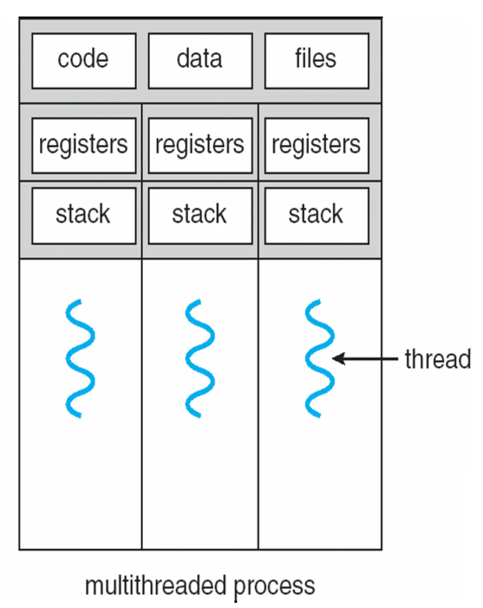

# 1. 프로세스

## 1. Process Concecpt

프로그램은 순서 있는 명령어의 집합으로 디스크에 저장된다. 프로그램을 실행한 instance가 프로세스가 되고 프로세스는 메모리에서 실행된다.

- 실행 중이라는 말은 다른 말로 flow of control을 가지고 있다고도 한다.
- 프로세스는 운영체제가 스케줄링하는 기본적인 단위이다. 프로세스는 여러 개의 프로세스가 한 번에 돌 수 있으므로 이름을 사용하지 않고 **process ID를 사용해서 구분**한다. a.exe라고만 관리하면 10개의 a.exe를 구분할 수 없다.
- 프로세스는 CPU contexts(registers), OS resources(memory, open files 등등), PID, state, owner 등등을 포함한다.

### pocess in memory

a.exe 형태의 프로그램은 storage에 기계어 코드로 저장된다. a.exe를 프로세스로 실행시키면 다음과 같은 과정을 통해 프로세스가 된다.

1. 운영체제는 프로세스를 위해 가상의 메모리 공간을 준비한다.
2. 프로그램을 실행시키면 storage의 데이터를 그대로 복사해서 메모리에 옮긴다.

- 메모리의 구성을 살짝 보자면 배열, 변수 이런게 메모리의 스택 공간에 쌓인다. 힙에는 다이나믹하게 어로케이션 된 malloc 같은 게 위로(높은 어드레스 쪽으로) 쌓인다. free 시키면 해제된다. 잘 보면 맨 위에 1기가(32bit기준)정도는 커널이 가지고 있는다. system call 같이 커널이 사용하는 코드가 커널 버츄얼 메모리에 매핑되어 있다. 밑에서 코드가 막 실행되다가 open 같은 걸 부르면 커널 버츄얼 메모리에서 찾아서 실행한다.

---

## 2. Process Creation

### Process hierachy

디렉터리 구조를 보면 트리 형태로 되어있다. 그처럼 프로세스도 무슨 프로세스 밑에 자식프로세스가 존재하는 방식으로 hierarchy를 가지고 있다. 여기 굉장히 중요한 말이 나온다. **하나의 프로세스는 다른 프로세스를 만들 수 있다**. 그렇다 보니 항상 계층적 구조가 만들어진다.

UNIX에선 이런 자식관계의 프로세스 트리를 프로세스 그룹이라 한다.

윈도우에서는 프로세스 hierarchy를 사용하지 않는다고 얘기한다. 사실 내부적으로는 hierarchy를 사용하지만 큰 의미는 없다.

### Process Creation

프로세스를 새로 만드는 것은 중요한 일이고, 애플리케이션 레벨에서는 불가능하므로 시스템 콜을 통해 운영체제에 부탁해야 한다. 보통은 fork(), CreateProcess()를 사용하고 여기선 fork()라고 할 예정이다. 프로그램 내부에서 fork()를 부르면 새로운 프로세스가 만들어진다. GUI 쉘에서 메모장을 켜면 메모장 process를 만드는 것이다.

프로세스는 트리구조이므로 가장 최상단에 위치한 최고 조상은 init 프로세스이고 PID는 보통 1번이다. 운영체제가 부팅하면서 init 프로세스를 만들고 나머지는 전부 init이 fork를 써서 만들어낸 프로세스이다. init을 제외하면 모든 프로세스는 프로세스가 만든다.

### Resource sharing

새로운 프로세스를 만들면 부모와 자식은 리소스를 공유하게 된다. 여기서의 리소스는 운영체제가 관리하는 모든 데이터가 다 포함된다. 프로세스가 실행하는 user id(그 사람의 권한 포함), 프로세스가 가지고 있던 파일들 등을 포함한다.

### Execution

부모와 자식이 만들어져서 실행하는 과정을 보면 부모는 둘이 동시에 동작할 수도 있고 부모가 끝나기를 자식이 기다릴 수 있다.

### Address space

프로세스가 새로 만들어지면 새로운 가상 커널 메모리 공간이 필요할 텐데, 아까 사진에서 본 가상의 커널 메모리 공간이 어떻게 만들어지냐면 그대로 복제해서 자식에게 그대로 전달해 준다. 물론 별개의 새로운 메모리이다.

프로그램을 실행시킨다는 건 프로세스를 만든다는 것이고 이게 어떻게 되냐면 쉘로부터 child 프로세스를 새로 만들어내고 특정한 역할(프로그램의 역할)을 하도록 세팅하는 것이다. 프로그램이 어떻게 실행되는지 잘 이해해야 한다.

---

## 3. Process State Transition

프로세스는 몇 가지 상태를 순환한다.

- 초기 상태의 프로세스는 new 상태이다. new 상태인 프로세스는 address space를 만들고 PC를 세팅하는 등 CPU를 쓸 준비를 한다.
- 프로세스를 ready 상태로 만든다.
- 프로세스를 running 상태로 만들고 그 프로세스에 CPU를 할당해준다.
- 그리고 프로세스가 CPU를 너무 많이 쓴다던가 인터럽트를 받는다던가 하면 CPU를 뺏어서 ready 상태로 만든다.
- running → ready 상태를 반복하다 exit된다.
- 프로세스가 I/O 장치를 기다리는 등 CPU를 사용하지 않아도 되면 waiting 상태로 바꾸게 된다. 그러다 I/O가 끝나면 다시 ready로 바꾸고 running으로 만든다.

즉 **ready running wating을 반복하다 종료하는게 프로세스의 생명주기이다.**


### PCB

이런 상태들은 PCB(Process Control Block)을 통해 관리된다.

PCB는 각 프로세스별로 하나씩 가지며 프로세스에 관한 모든 정보를 가지고 있는 구조체이다. 중요한 정보들은 다음과 같다.

- Process state
- Program counter
- CPU registers
- CPU schduling information : CPU를 얼마나 썼는지 등의 정보
- Memory management information
- Accounting information
- I/O status information, 등등 굉장히 많음

Linux에서는 task_struct에 정의되어 있는데, 1K가 넘을 정도로 많은 정보가 들어있다.

실제로는 리눅스에서 이런 task_struct(TCB)를 doubled linked list로 되어있는 task list로 관리한다. task list를 잘 뒤져보면 모든 프로세스의 정보가 다 있다.

---

## 4. Context Switch

CPU가 수행중인 running 상태의 프로세스를 변경하는 작업을 Context switch라 한다. running 상태인 프로세스는 해당 프로세스에 맞는 PC 값 등의 CPU Context를 가지고 있을 것이고, Context switch를 위해서는 현재 작업중인 Context 들을 저장해야 한다. 이때 사용되는 것이 PCB이다.

Context switch는 레지스터, 메모리를 저장했다가 복원했다가 하는 일을 해야하고 컨텍스트 스위칭이 일어나면 캐시도 미스가나서 다시 바꾸고, 히트가 나고 이런 캐시와 관련된 작업도 수행해야한다. 따라서 굉장히 힘든(overhead)한 작업이다.

다시 Context switch를 정리하자면 **P0 프로세스가 실행중이다가 인터럽트나 시스템 콜이 들어오면 운영체제가 PCB0에 CPU의 상태값들을 저장한다. 그리고 P1 프로세스를 실행해야지 라고 판단했다면 PCB1의 값들을 다 꺼내서 CPU에 덮어쓴다. 로딩이 끝나면 P1 프로세스를 돌리고 멈추는 과정을 계속 반복한다**.

context switch는 overhead가 많이 들어가는 작업인데, 그럼에도 context switch를 해야하는 이유는 대부분의 어플리케이션이 I/O를 포함하기에 그 시간에 context switch를 해서 다른 프로세스가 CPU를 사용할 수 있도록 하기 위해서이다.

---

# 2. 쓰레드

## 1. 프로세스의 단점

프로세스도 좋지만 프로세스는 다음과 같은 요소들 때문에 매우 비싸다.

- address space
- OS resources
- Hardware execution state (PC, SP, registers 등등)

웹 서버 예제를 보자.

```cpp
while(1){
int sock = accept(){
if((pid = fork()) == 0){
		// Handle client request
	}else{
		// Close socket
	}
}
```

이렇게 부모 프로세스에서 실행할게 굉장히 적은데도 병렬 작업을 위해서는 새로운 프로세스를 만들어야 하고, 굉장히 비효율적이다.

프로세스를 여러 개 만든다면 addres space를 그 수만큼 복제해서 PCB, page tables 등등의 Space를 사용하고, OS structures를 생성하고, fork하는 등 굉장히 무거울 뿐 아니라 모든 멀티 프로세스는 같은 코드와 address를 사용한다. 또, 같은 권한과 파일, 소켓 등의 리소스도 사용한다. 정확히 같은 자원들을 사용하지만 공유하지 않는 문제가 존재하는 것이다.

---

## 2. 쓰레드의 도입

프로세스의 문제점을 해결하기 위해 address space, 리소스 등의 일반적인 프로세스 속성은 남겨두고 PC, SP, register 등의 **Execution state만 따로 빼서 실행하는 것이 쓰레드이다**.

프로세스들은 process items는 공유하고 쓰레드는 PC, 레지스터, Stack, 스택 포인터, 상태(러닝인지, 레디인지 등)만 가지고 있으면 프로세스는 하나지만 세개의 프로세스가 돌 수 있게 만드는 것이다.

이제 프로세스는 쓰레드를 담는 그릇이라 생각하면 된다. 쓰레드를 위해서는 쓰레드 관리 정보를 따로 가지고 있다. 마치 PCB처럼 운영체제는 TCB (Thread Control Block)를 가진다.

메모리 공간 중 스택 공간을 쓰레드가 따로 쓸 수 있게 해줘야 한다.

하나의 프로세스에 쓰레드가 세 개 돌고 있다면 메모리는 다음과 같다.

이렇게 된다. 코드, 데이터, 파일은 공통으로 사용하고, 레지스터와 스택은 쓰레드가 각자 가지는 것이다.

## 이게 멀티쓰레드 프로세스이다. 멀티 쓰레드는 프로세스의 컨텍스트와 동일한 과정으로 병렬로 실행된다. 멀티 쓰레드로 프로그래밍을 하려면 운영체제에 특수한 명령을 보내야 한다.

## 3. 쓰레드란?

- 프로세스 내에 있는 인스트럭션의 시퀀스이다.
- 대부분 레지스터, PC, 스택 메모리 공간을 가진다.
  - 스택 포인터와 스택은 구분해야 한다. 스택 포인터는 스택을 가리키고 있는 **레지스터**이다.
- **쓰레드는 대부분의 데이터와 프로세스 인스트럭션을 공유**한다.
  - 한 쓰레드가 공유된 데이터에 접근하면 다른 쓰레드도 볼 수 있다.
- 쓰레드는 대부분의 **운영체제 상태를 공유**한다.

---

## 4. Processes vs Threads

- 쓰레드는 하나의 프로세스에 담겨있다.
- 반면에, 프로세스는 멀티플 쓰레드를 가질 수 있다.
- **쓰레드끼리는 같은 address 내에 있으니 싸게 데이터를 공유할 수 있다.**
- 쓰레드는 운영체제가 관리하는 스케줄링의 단위가 된다.
- 프로세스는 쓰레드를 수용하기 위한 컨테이너로 생각하면 된다.

### 프로세스와 쓰레드의 유사한 점

- 각자의 로지컬한 control flow를 가질 수 있다.
- 각자 동시에 다른 것들과 실행될 수 있다.
- 컨텍스트 스위치

### 프로세스와 쓰레드의 차이점

- 쓰레드는 코드와 데이터를 **공유**한다.
  - 그러나, 프로세스는 그렇지 않다. 같은 코드와 데이터를 **복제해 온다.**
- 쓰레드가 프로세스보다 훨씬 저렴하다.
  - 리눅스에선 거의 2배 차이. address space를 새로 만들지 않아도 되고, 하드웨어 상태만 관리해 주면 되니까 훨씬 쉽다.

address space 관점에서 생각해보면, 멀티 프로세스는 여러 개의 address space를 가진다. 하지만 멀티 스레드는 다음과 같이 하나의 address space를 공유하고, 분리해서 사용한다.


---

# 3. 유저 레벨 쓰레드

### 커널 쓰레드

- **OS는 쓰레드와 프로세스를 관리한다.**
- 모든 쓰레드 연산은 커널에 구현되어 있다.
- OS가 시스템의 모든 쓰레드를 스케줄링한다.
  - 만약 I/O 등의 대기 중인 프로세스의 스레드가 있다면 OS는 그것을 알고 그 프로세스의 다른 쓰레드를 실행시킨다.
- 커널 쓰레드는 프로세스보다 싸다.

### 커널 쓰레드의 한계

- 여전히 비싸다.
  - system call을 사용하지 않고 더 싸고 빠르게 동작하기를 원한다.
- 프로세스보단 훨씬 가볍지만, 쓰레드 연산은 모두 system call이다.
- 커널은 각 쓰레드의 정보를 유지해야만 한다. 따라서 쓰레드의 총개수가 정해져 있다.

쓰레드를 더 싸고 빠르게 만들기 위해서는, 그들을 유저 레벨에서 구현해야 한다.

**Portable** : 유저 레벨 쓰레드는 완전히 런타임 시스템(user-level library)에 의해 관리된다. 즉, 운영 체제와는 독립적이다.

이런 이유에서 유저 레벨 쓰레드가 등장했다. 유저 레벨 쓰레드는 **작고 빠르다**!

- 각 쓰레드는 PC, registers, stack 그리고 **small thread control block(TCB)**로 나타나진다
- 쓰레드를 생성하고 쓰레드들 간의 동기화는 커널이 아닌 **프로시저 calls에 의해 이루어진다**.
- 유저 레벨 쓰레드는 커널 레벨에 비해 약 **10~100배 빠르다**.

**유저 레벨에서 쓰레드의 관리가 가능한 이유는 뭘까?**

- 쓰레드는 같은 address space를 공유한다. 따라서 쓰레드는 address spacce를 조작할 필요가 없다.
- 또, 쓰레드는 PC, SP, 레지스터 등의 하드웨어 context만 다르다. 이 context 들은 유저 레벨 프로세스에서 조작할 수 있다.

---

## 1. User-level Threads의 구현


### 유저 레벨 쓰레드 Context Swtich

- 현재 실행 중인 쓰레드의 context를 저장한다.: **그것의 스택에 machine state를 모두 push 한다.**
- 다음 쓰레드의 context를 복구시킨다.: **다음 쓰레드의 스택에서 machine state를 pop 한다.**
- 다음 쓰레드가 현재 쓰레드가 된다.
- 새로운 쓰레드로 caller에게 돌아간다.: 다음 쓰레드의 PC 값으로 실행을 재개한다.

유저 레벨 쓰레드는 커널 쓰레드에 비해 Context Switch가 **매우 간단**하다.

### User-level Threads 한계점

- 유저 레벨 쓰레드는 운영체제 내부에서 볼 수 없다.
- 따라서 운영체제가 이상한 결정을 내릴 수 있고 이는 CPU의 낭비로 이어진다.
  - 할 일이 없는 쓰레드만 가진 프로세스를 스케줄링하는 것
  - I/O를 시작한 쓰레드를 가진 프로세스 전체를 막는 것, 실행할 준비가 된 다른 쓰레드가 있어도 막아버려서 문제가 된다.
  - 락을 들고 있는 쓰레드를 가진 프로세스를 스케줄링하지 않는 것
- 이러한 문제를 해결하기 위해선 커널과 유저 레벨 쓰레드의 매니저간의 협력이 필요하다.
  - 예를 들어, OS의 차단 system call은 호출된 쓰레드가 해당 작업이 완료될 때 까지 block되며 프로세스 전체를 block한다. 따라서 이러한 차단을 피하기 위해 라이브러리에서 커널의 차단 시스템 콜을 대신하여 비차단 호출을 사용해야 한다.
