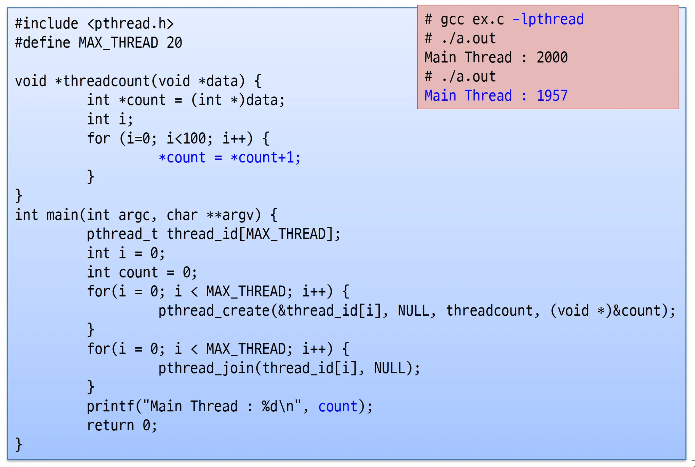
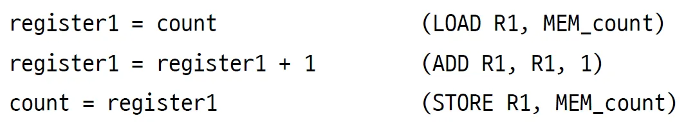
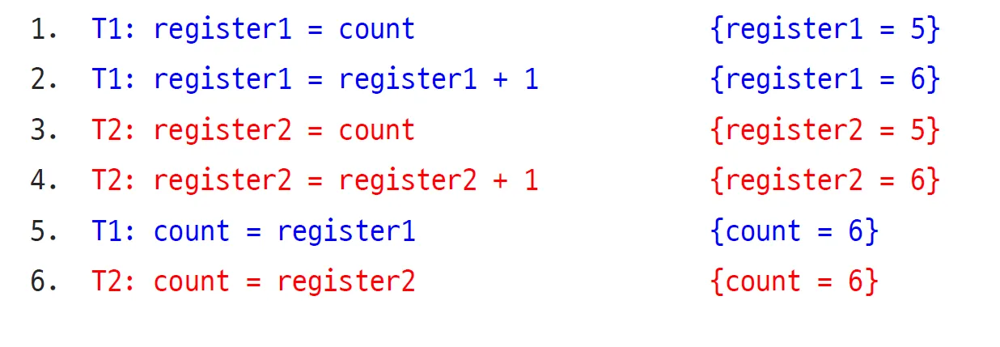
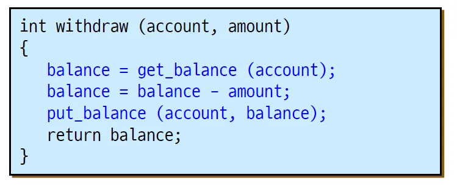
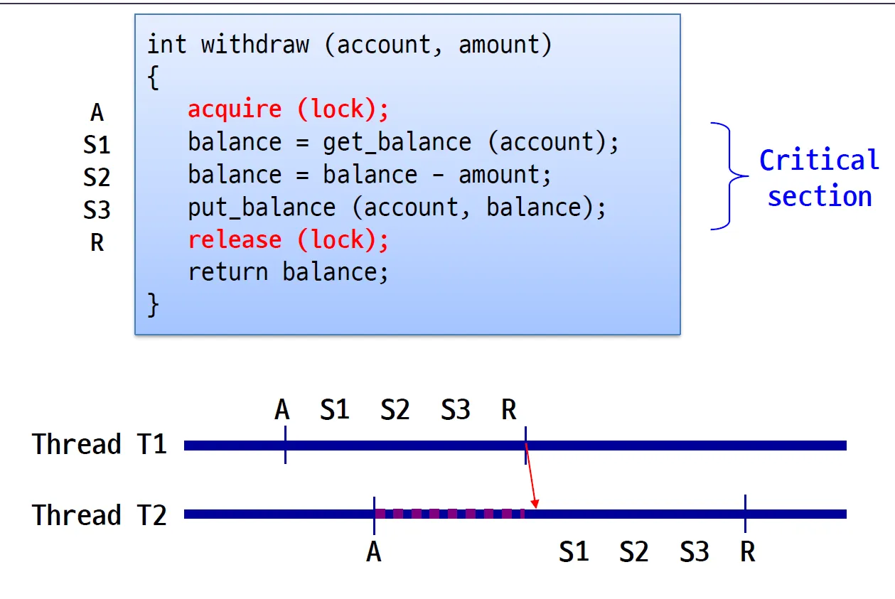
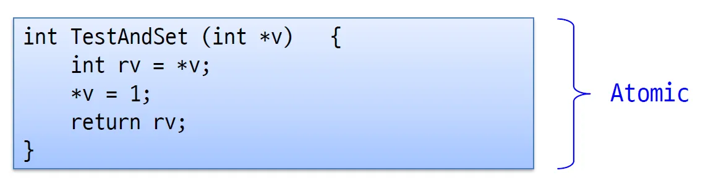
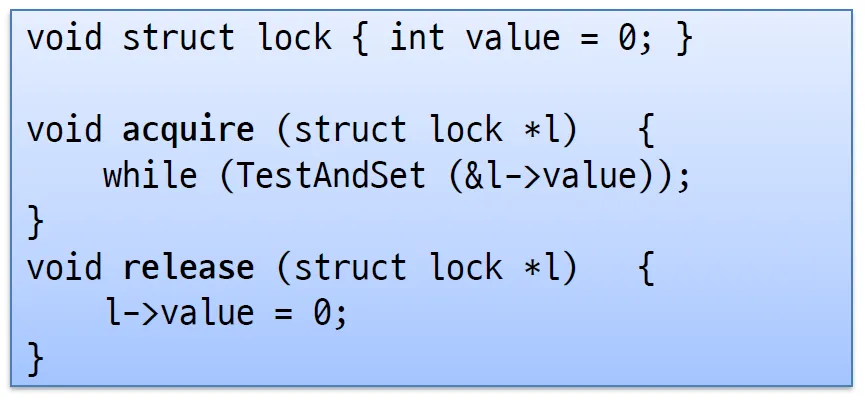
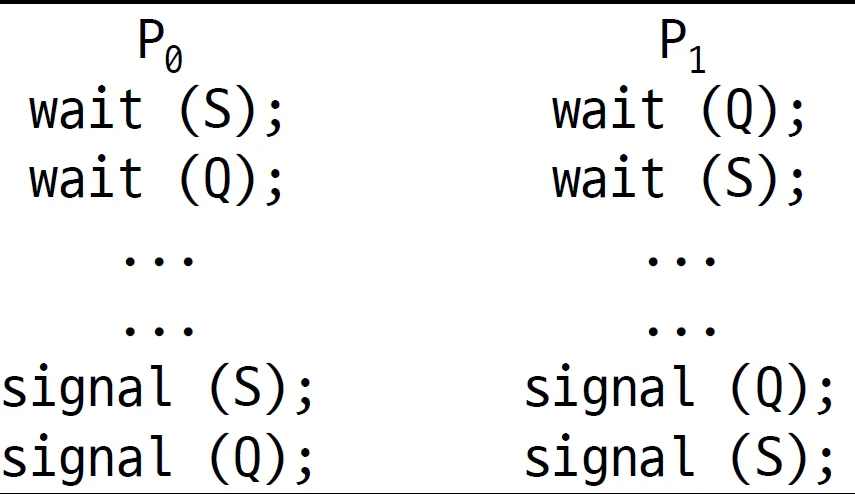
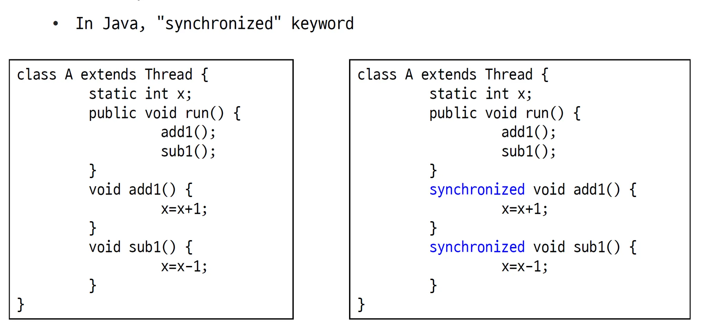

## 1. Synchronization

### Synchronization Problem

동기화 문제는 **공유되는 자원에 동시에 접근**할 때 생기는 문제이다. 쓰레드 뿐 아니라 프로세스에서도 일어날 수 있다. 그런 문제를 race condition이 발생했다고 얘기한다.

- **race condition**
  - **프로세스나 쓰레드들이 공유되는 데이터에 동시에 접근해서 읽고 쓰고를 반복하는 상황**이다.
  - 이 문제는 **non-determinstic 하다.** 확실히 문제가 발생하는 게 아니라, 문제가 생길 수도 있고 안 생길 수도 있다는 것이다. 문제가 생길 가능성은 타이밍에 달려있다.

이런 상황에서 적절한 메커니즘이 필요하다. 그래서 동기화를 했는지 안 했는지에 따라 이런 문제를 잘 막았는지 아닌지가 결정된다.

**동기화**는 모든 공유되는 자료 구조에서 필수적이다.

- 버퍼, 큐, 리스트 등에서 문제가 생길 수 있다.
  
  이 코드에서도 race condition이 발생한다. *count = *count + 1을 보면 사실 최소 세 개의 어셈블리어로 구분되고, 여기서 문제가 발생한다.
  
  어떤 문제가 생길 수 있을까? 어셈블리어 코드 레벨에서 분석해 보자.
  

---

## 2. Citical Sections

쓰레드간의 스택은 따로 있기에 로컬 변수는 절대 공유되지 않는다. 일반적인 경우라면 포인터도 문제가 생기지 않을 것이다.

**글로벌 변수**와 **동적 할당된 객체**에서 문제가 생긴다. 동적 할당된 객체는 힙에 쌓이고 공유되기 때문이다. 꼭 쓰레드 뿐 아니라 프로세스에서도 shared-memory 메커니즘으로 문제가 생긴다.

결국 동기화의 문제는 **어떤 데이터를 공유하고 있고**, **동시에 접근해서 읽고 쓰고를 반복**하면 생기는 것이다.

**shared resources에 프로세스던 쓰레드던 접근하여 자원을 업데이트 시키거나 뭔가를 쓰는 코드의 조각을 Critical sections**라 한다.

여기서 파란색 코드 세 줄이 critical sections이다.

critical sections이 있다는 것은 **race conditions**이 있다는 것이다.

### 동기화 문제를 잘 해결하려면 다음의 사항을 지켜야 한다.

**Mutual exclusion**

- **크리티컬 섹션에는 최대 하나의 쓰레드만 존재해야 한다.**

**Progress**

- 크리티컬 섹션에 한 쓰레드가 들어갔으면, 그 쓰레드는 반드시 적절한 시간 내에 결과를 내고 나와야 한다.
- 또, 크리티컬 섹션 밖에 있는 쓰레드는 다른 크리티컬 섹션에 들어가는 쓰레드를 방해해서는 안된다.

**Bounded waiting**

- 크리티컬 섹션에서 한 명이 나오면 반드시 다른 사람이 들어가야 한다. 순서가 밀려서 늦게 들어갈 수는 있지만 언젠가는 들어가야 한다.

**Performance**

- 크리티컬 섹션에 들어갔다 나오는 과정은 오버헤드가 발생하는데, 그 오버헤드를 최대한 줄여야 한다.

### 동기화 문제를 방지하는 방법은 4가지가 있다.

**Locks**

- 굉장히 원초적이고 기본적인 방법이다.

**Semaphores**

- 일반적으로 많이 사용한다. 여러 종류가 있는데 그들을 잘 알아둬야 한다.

Monitors

- Locks, Semaphores를 이용해서 language 레벨에서 지원하는 방법이다.

Messages

- 메시지를 주고받는 방법이다. 메시지를 잘 주고받아서 동기화를 맞춘다.

---

# 2. Locks - spinLock

lock은 말 그대로 자물쇠 역할이다. 크리티컬 섹션에는 한 명만 들어가야 하는데, 들어갈 때 lock 하고, 나올 때 unlock 하는 방식으로 동기화 문제를 방지한다.

아래에서 배우는 방식은 Locks 중에서도 spinLock이다.

- `acquire()` : lock이 풀릴 때 까지 기다렸다가 풀리면 잡는다. 풀려있다면 그냥 잡는다.
  - 대기하다 보면 여러 쓰레드가 대기할 수 있다. 여러 쓰레드들을 다 고려해서 `acquire()`하는 메커니즘을 고려해야 한다.
- `release()` : unlock

Lock은 초기에 열려있다. 크리티컬 섹션에 들어갈 때 acquire을 부르고 나올 때 release 한다.

acquire과 release 사이에 쓰레드는 락을 잡고 있어야 한다. 또, 최대 하나의 쓰레드만이 락을 잡고 있어야 한다.

아래의 그림을 잘 이해하자!

Lock은 spin할 수 있어서 **spinlock**이라 불리고, block할 수 있어서 **mutex**라 불린다.

### Problems with Spinlocks

- spin은 CPU cycle을 끔찍하게 많이 낭비한다.
- 가장 큰 문제는 acquire에서 while문을 무한히 돈다는 것이다. 그 말은 CPU를 계속 사용한다는 것이다.
- 크리티컬 섹션이 길어지면 대기하는 쓰레드는 그만큼 CPU 사이클을 더 많이 낭비하고 spin이 많아진다.
- lock을 가지고 있는 쓰레드가 갑자기 죽거나, context switch가 lock을 가지고 있지 않은 쓰레드, 혹은 아예 다른 프로세스로 넘어간다면 낭비가 더 심해진다.

따라서 spinlock은 high level의 동기화 구성을 구성할 때만 기본적인 요소로 사용하는 게 좋다.

---

# 3. Hardware Atomic Instructions

하드웨어적인 도움을 받는 해결책이다.

Test-and-Set이라는 인스럭션이 있는데 예를 들어 C로 바꾸면 이렇게 동작할 것이다. 당연히 실제로는 하드웨어적으로 동작한다.

위의 인스트럭션이 어셈블리어 레벨에서 Atomic 하게 작동하기에 아래와 같이 사용할 수 있다.

기존에 잘못된 알고리즘에서는 l.value를 확인하고 값을 바꾸는 두 과정을 거쳐서 잘못된 부분이 생겼는데, 하드웨어적으로 도움을 받아서 CPU 한 클락에 TestAndSet Atomic 하게 실행하기에 그사이에 컨텍스트 스위칭이 일어날 수 없다.

---

4. Disable Interrupts
   `acquire()`에서 `cli()`를 불러서 인터럽트를 무시하기 시작할 수 있다.

그리고 `release()`에서 `sti()`를 불러서 이제 인터럽트를 받겠다고 알려줄 수 있다.

인터럽트를 무시하면 당연히 타이머 인터럽트도 받지 않게 되고, 당연히 context switch가 일어나지 않는다.

이 방법도 문제를 가지고 있다.

- 인터럽트를 켜고 끄는 건 당연히 **커널만 가능**하다.
  - 애플리케이션이 임의로 cli()를 부를 수 있으면 그 프로세스가 CPU를 독점하기에 위험하다.
- 멀티프로세서 CPU에서 여러 CPU가 cli()를 호출하면 문제가 생긴다.
- 크리티컬 섹션이 길다면 아무 인터럽트도 받지 못해서 문제가 생길 수 있다.

spinlock와 마찬가지로 high-level 동기화를 구현하기 위한 기본적인 방법으로만 사용하자.

---

# 5. Semaphores

- Semaphores의 큰 특징은 **busy wating을 요구하지 않는다**는 것이다.
- 주로 두 개의 연산을 지원한다.
  - **Wait(S)** : 내부의 count 값을 감소시킨다. 즉, 세마포어가 열릴 때 까지 block한다. P나 down 함수라고도 불린다.
  - **Signal(S)** : count 값을 증가시켜 다른 쓰레드가 들어올 수 있는 기회를 제공한다. V나 up 함수라고도 불린다.

### Semaphores의 block

- 쓰레드가 크리티컬 섹션에 들어갈 수 없다면 기다리지 않고 block한다.
- **프로세스나 쓰레드를 위해 큐를 가지고 있고**, 큐를 이용해서 block한다.
- **wait()**
  - 먼저 count값을 감소시킨다. 락이 열려있다면 그냥 들어가고, 닫혀있다면 block시킨다.
  - block 당한 쓰레드는 **CPU를 사용하지 않고 큐에서 대기**한다. CPU 스케줄러의 wait queue가 있는 느낌이다. 이 과정은 OS가 당연히 필요하다.
- **signal()**
  - 세마포어를 연다(counter값을 증가시킨다).
  - 큐에 기다리고있는 쓰레드가 있다면 쓰레드를 unblocked 시킨다.
- 세마포어는 history를 가지고 있다고도 한다.
  - history는 counter이다.
  - counter 값으로 세마포어를 열고 닫는다. counter가 0보다 작아지면 닫힌 것이다.
  ### semaphore의 종류

**Binary semaphore**

- mutex라고도 불린다.
- spinlock과 마찬가지로 크리티컬 섹션에 하나만 들어가야 한다. 따라서 **mutually exclusive**한 것이 보장된다.
- count 값을 1로 두면 mutex가 된다.

**Counting semaphore**

- 크리티컬 섹션에 여러 개가 들어갈 수 있다.
- **쓰레드나 프로세스가 가능한 많이 들어가는 것을 허용한다.**
- count 값을 N으로 두면 Counting semaphore가 되고, count 값만큼 쓰레드에 들어갈 수 있다.

### Problems with Semaphores

- **shared되는 글로벌 변수를 사용**한다. 글로벌 변수이므로 코드의 어느 부분에서든 접근이 가능하다.
  - 글로벌 변수는 사실 안좋은 엔지니어링이다.
- 세마포어는 뮤텍스와 coordination(scheduling) 둘 다에서 사용된다.
- signal, wait의 순서가 중요하고 누락이 있어서는 안된다.
- Deadlock과 starvation의 위험이 있다.
- Semaphores는 **사용하기도, 버그를 잡아내기도 매우 힘들다.**
  - 그렇다면 프로그래밍 언어 차원에서 지원을 해주면 어떨까?

---

# 6. Deadlcok and Startvation

**Deadlock**

- 데드락은 여러 프로세스들이 서로를 기다리다가 락이 풀리지 않고 죽어버리는 상황을 말한다.
  
  프로세스가 S, Q의 락을 잡아야 한다고 생각해보자. 그런데 중간에 컨텍스트 스위치가 일어나면 P1은 S를 잡을 수 없다. 그리고 P0는 Q를 잡을 수 없다.

만약 P1은 Q가 아닌 S를 먼저 잡으면 문제가 생기지 않는다.

- 데드락은 해결 방법은 없고 코드를 잘 짜서 데드락이 생기지 않도록 설계해야 한다.

**Starvation**

- 데드락 등의 이유로 프로세스가 더 이상 진행이 되지 않아서 굶어 죽는 상황이다.

**Priority Inversion**

- CPU 스케줄링의 문제이다. 스케줄링의 우선순위가 낮은 프로세스가 lock을 잡고 있어서 우선순위가 높은 프로세스가 실행이 되지 못해서 생기는 문제이다.

---

# 7. Monitors

- **프로그래밍 언어가 구성**하는 것이다.
  - **동기화 코드가 런타임에 컴파일러에 의해 추가된다.** 크리티컬 섹션에 알아서 코드를 삽입해주는 방식이다.
- **모니터는** 아래의 사항을 가지는 **소프트웨어 모듈**이다.
  - 모니터는 shared 데이터 구조를 가진다.
  - 공유된 데이터를 연산하는 과정도 가지고 있다.
    
- 이렇게 쓰게되면 글로벌 변수에 접근하는 것에 대한 프로텍션이 가능하다.
- 자바에서는 동기화 문제의 위험성이 있는 함수에 `synchronized` 를 붙여서 lock을 구현할 수 있다.
