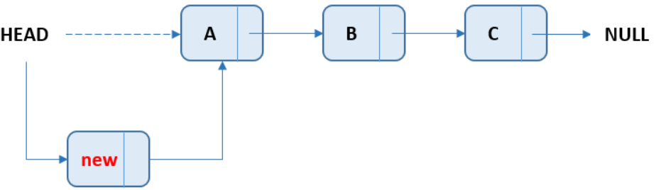

# Linked List
연결 리스트(Linked List)는 데이터를 노드(Node) 단위로 연결해서 저장하는 자료구조.
각 노드는 **데이터**와 다음 노드를 가리키는 **포인터**로 구성됨.

배열과 달리 크기가 **가변적**이며, 메모리의 연속적인 공간을 차지하지 않음.

### 데이터의 삽입
노드의 참조를 변경하여 데이터를 삽입할 수 있음.
- `list.addFirst();`

- `list.addLast();`

### 데이터의 삭제
노드의 참조를 변경하여 데이터를 삭제할 수 있음.
- `list.removeFirst();`

- `list.removeLast();`

---
### 문제
1. 이중 연결 리스트를 사용하면 어떤 케이스에서 성능 향상을 기대할 수 있나요?