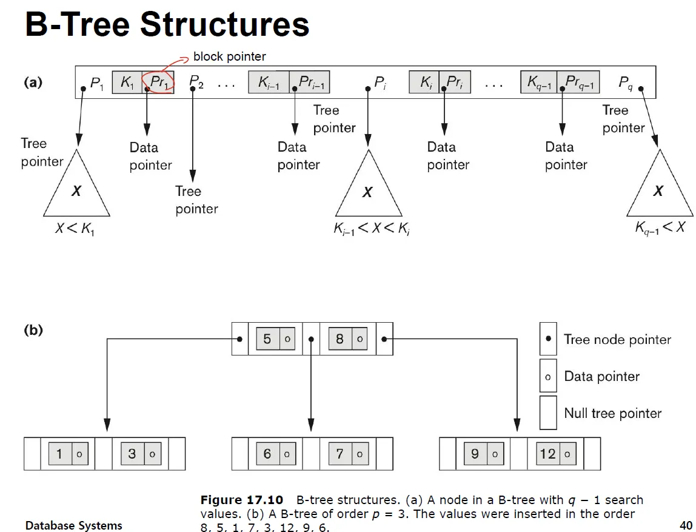
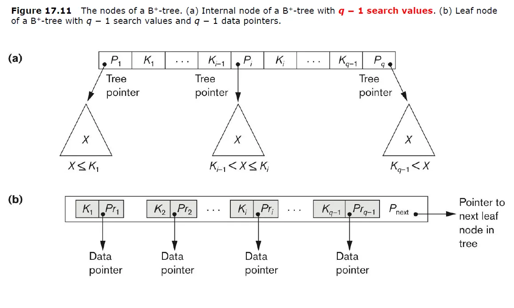

# B-Tree

---

## B-Tree의 정의와 삽입, 삭제

### B-Tree의 정의

1. B-Tree는 balancing search tree로, 각 노드가 여러 개의 키와 자식을 가질 수 있다.
2. 차수(order)가 m인 B-Tree는 다음과 같은 조건을 만족한다.
   - 루트 노드는 리프 노드가 아닌 경우 최소 2개의 자식을 갖는다.
   - 루트 노드를 제외한 모든 내부 노드는 최소 m/2(올림)개의 자식을 갖는다.
   - 모든 노드는 최대 m개의 자식을 가질 수 있다.
   - 자식이 k개인 노드는 정확히 k-1개의 키를 갖는다.
   - 모든 키는 오름차순으로 정렬되어 있다.
3. 모든 leaf node(external node)는 같은 레벨에 존재한다. external node는 원소를 검색하지 못했을 때 도달하는 노드이다.
4. 각 노드의 키는 자식 서브트리의 모든 키를 구분하는 경계 역할을 한다:
   - 노드의 i번째 키보다 작은 모든 키는 i번째 자식 서브트리에 있다.
   - 노드의 i번째 키보다 크고 i+1번째 키보다 작은 모든 키는 i+1번째 자식 서브트리에 있다.
5. B-Tree는 디스크 기반 스토리지 시스템에 최적화되어 있으며, 노드가 디스크 블록이나 페이지에 대응하도록 설계되었다.

### B-Tree 삽입

### B-Tree 삭제

삭제는 리프노드에서만 일어난다.

삭제할 아이템이 리프노드가 아니라면 삭제할 노드의 후속노드와 swap한 후 노드를 삭제한다.

삭제할 아이템이 리프노드에 있다면

- 노드에 다른 아이템이 존재하면 단순 삭제한다.
- 그런데, 삭제 후 2번 정의를 violation 하는 경우(m/2 개의 자식 필요) 형제 노드에서 아이템을 빌리고 삭제한다.
- 형제노드에서도 빌릴 수 없다면 부모와 병합한다.

10을 삭제한 뒤 60을 삭제하려면 90을 빌려오고 삭제할 수 있다.

60을 삭제하고 95를 삭제하려하니 형제에게도 빌릴 수 없어서 부모와 병합한 뒤 삭제해야만 한다.

---

## 데이터베이스 시스템에서의 B-Tree

B-Tree는 data block을 모든 레벨의 record에서 data block을 pointing 하고
B+ Tree는 leaf node에서만 data block을 pointing 한다.

기본적으로 B Tree에서 search를 할 때 q개의 pointer가 있고 data는 1부터 q-1까지, 총 q-1개의 search value를 가진다.

P1이 가리키고 있는 sub tree들은 K1보다 작은 값이다. Pi는 Ki-1, Ki 사이의 값을 가진다.

B tree와 B+ tree의 차이는 data pointer이다.

B tree는 위의 사진처럼 어떤 노드에서던 data pointer를 가진다.

---

## 데이터베이스 시스템에서의 B+ tree

B+ tree는 B tree와 유사한데 data pointer가 leaf node에만 존재하는 balanced tree이다.

내부 노드에 있는 키 값은 리프 노드에도 중복해서 존재할 수 있다.

예를 들어 6보다 크거나 같은 값을 찾으라는 쿼리가 있다면 6을 찾고 link를 타고 오른쪽으로 쭉 찾으면 된다.

- 여기서 data pointer는 disk block에 대한 pointer이다.

(a)는 internal node인데 B tree와 유사하다. B tree는 key와 data pointer가 있었는데 B+ tree는 key만을 가진다. (b)는 leaf node인데 key에 대한 data pointer와 next block에 대한 pointer를 가지고 있다.

B+ tree 또한 전체 포인터가 p개라면 반 이상은 차있어야 한다.

---

## 예상 질문

1. B-Tree와 B+Tree의 주요 차이점은?
