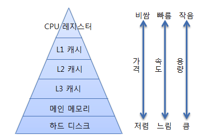

# 컴퓨터 구조

---

# 기억장치 계층 구조

CPU와 데이터를 주고받는 **기억장치 계층 구조**.
컴퓨터는 여러 단계의 기억장치를 계층적으로 배치해서 **자주 쓰는 데이터는 빠른 저장소**에, **덜 쓰는 데이터는 느리고 큰 저장소**에 넣는 구조로 동작.

## 레지스터 (Register)

- CPU 내부에 존재, 가장 빠름. CPU가 명령어를 실행할 때 직접 사용
- 용도 **:** 연산에 사용될 데이터를 임시 저장
- 특징
    - 접근 속도 : 수 나노초 이내
    - 용량 : 수십~수백 바이트
    - 종류 : 일반 목적 레지스터, 플래그 레지스터 등
- 예 : x86의 `EAX`, `EBX`, `ECX`, ARM의 `R0 ~ R15`

## 캐시 메모리 (Cache Memory)

- CPU와 RAM 사이에 위치. 자주 사용되는 데이터를 미리 가져와 저장해둠 (locality)
- 메모리 병목 현상을 해결함(CPU 연산 속도와 RAM 전달 속도의 차이)
- 구조
    - **L1** : CPU 코어 내부, 매우 작고 빠름 (몇 KB)
    - **L2** : CPU 코어 외부, 더 큼 (수백 KB~수 MB)
    - **L3** : 코어 간 공유, 더 큼 (수 MB~10MB 이상)
- 특징
    - 접근 속도 : 몇 나노초~수십 나노초
    - 데이터 일관성 문제 때문에 복잡한 제어 필요
- 주요 개념
    - **캐시 히트(Cache Hit)** : 원하는 데이터가 캐시에 있을 때
    - **캐시 미스(Cache Miss)** : 캐시에 없어서 메인 메모리 접근해야 할 때

## 주기억장치 (RAM)

- 현재 실행 중인 프로그램과 데이터 저장
- CPU가 직접 접근 가능한 최대 단위의 메모리
- 일반적으로 DRAM(Dynamic RAM) 사용
- 특징
    - 접근 속도 : 수십~수백 나노초
    - 용량 : 수 GB ~ 수십 GB
    - 휘발성
- 역할
    - 실행 중인 OS, 애플리케이션, 캐시 미스 시 데이터 로딩

## **보조기억장치 (Secondary Storage)**

- 프로그램, 문서, 사진 등 장기 저장용
- 대표적인 장치
    - **SSD (Solid State Drive)**: 빠름, 비쌈
    - **HDD (Hard Disk Drive)**: 느림, 쌈
- 특징
    - 접근 속도: SSD는 마이크로초, HDD는 밀리초
    - 용량: 수백 GB ~ 수 TB
    - 비휘발성: 전원 꺼도 내용 유지
- CPU는 직접 접근 못하고 OS가 RAM에 로딩해서 사용함

---

# 문제

1. 기억장치 계층 구조
    1. 캐시 메모리는 하드웨어 부품인가? 어디에 존재하는가?
    2. DRAM과 SRAM의 차이
    3. 보조기억장치에 저장된 프로그램이 실행되는 전체 과정
2.