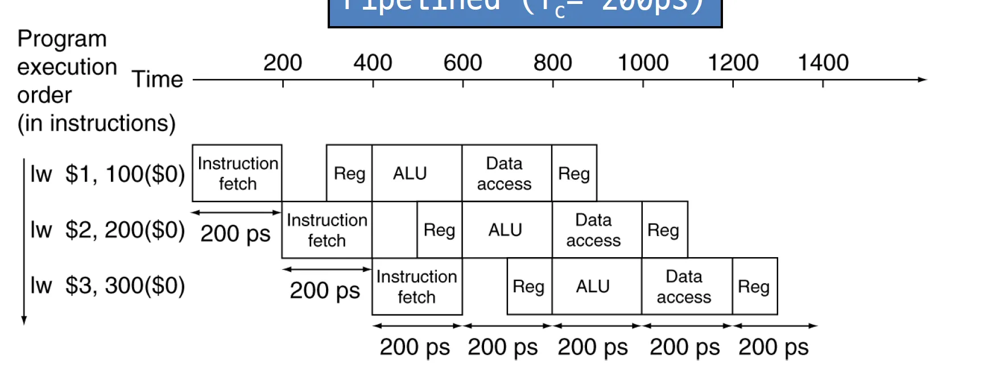
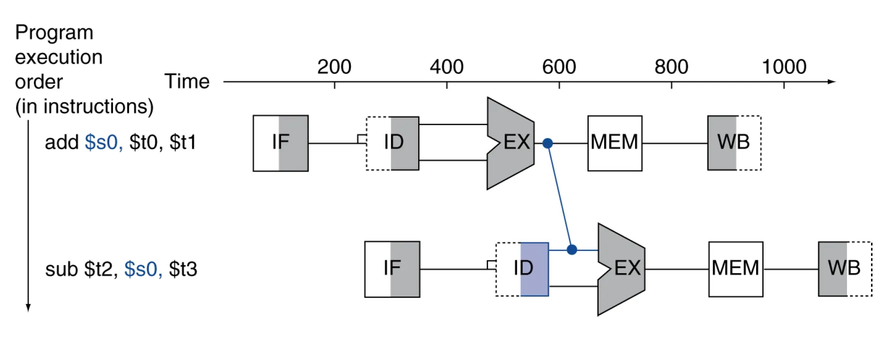
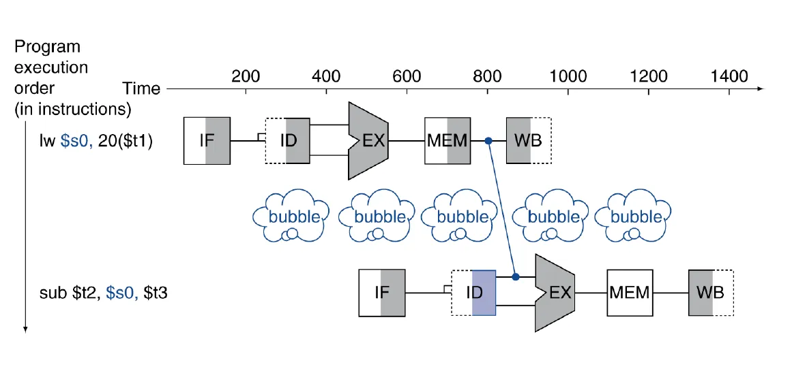
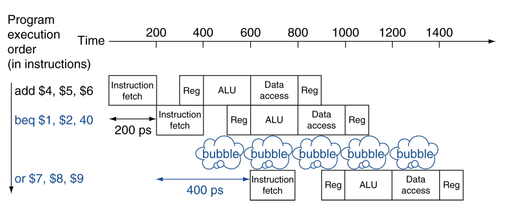

## 1. 폰노이만 아키텍처

폰노이만 아키텍쳐가 등장하기 전 컴퓨터들은 특정 작업만을 수행하도록 물리적으로 설계되는 고정 프로그램 컴퓨터, 프로그램이 천공 카드와 같은 외부 매체를 통해 입력되는 외부 프로그램 컴퓨터 방식으로 동작하였다. 컴퓨터에게 무언가 다른 일을 시키기 위해서는 수많은 스위치를 조작하고 전선을 옮겨 꽂는 복잡한 일들을 수행해야 했다.

폰노이만 아키텍쳐는 프로그램 내장 방식으로 stored-program 개념을 도입하여 컴퓨터의 활용성을 대폭 향상했다. 폰노이만 아키텍쳐의 특징들을 알아보자.

1. 컴퓨터는 CPU, 메모리, 입출력 장치, 버스로 구성된다.
2. 명령어와 데이터가 동일한 메모리에 저장된다. 프로그램이나 명령어를 메모리에서 읽을 때 해당 명령어가 데이터인지, 코드인지 구별할 필요가 없다.
3. 명령의 처리는 Fetch → Decode → Execute → Store 사이클을 따라 순차적으로 처리한다.
4. 컴퓨터에서 다른 작업을 시키려고 할 때 굳이 하드웨어를 재배치할 필요 없이 소프트웨어만 교체하면 되기에 범용성이 크게 향상된다.

폰노이만 병목현상이라는 단점이 존재한다. CPU와 RAM 사이의 데이터 전송 속도가 CPU와 ROM 사이의 속도보다 빠를 때 발생한다. CPU가 메모리에 접근하여 데이터를 가져오기 위해 대기해야 한다는 것이다. 이는 프로그램 메모리와 데이터 메모리가 하나의 버스를 공유하기 때문에 발생한다.

---

## 3. 레지스터

레지스터는 데이터를 일시적으로 저장하는 기억장치이다. CPU 옆에 붙어있고 매우 빠르다. CPU는 레지스터를 통해 메모리로 데이터를 전송하거나 연산하는 등의 작업을 수행할 수 있다. 범용 레지스터, PC, IR, Stack Pointer 등 특수 목적 레지스터, 인덱싱을 위해 사용하는 인덱스 레지스터 등이 존재한다.

레지스터와 캐시메모리를 헷갈려선 안된다. 레지스터는 CPU 내부를 구성하는 기억장치이고 캐시메모리는 CPU와 메인메모리 사이에 위치한 고속 기억장치이다.

참고로 64bit 시스템은 하나의 레지스터가 저장 가능한 공간의 크기가 64bit인 시스템이다.

---

## 3. Processor

CPU는 프로그램의 연산을 실행하고 처리하는 컴퓨터의 제어 장치이다. 프로세서라고도 불리며 외부에서 정보를 입력받아 기억하고, 컴퓨터 프로그램의 명령어를 해석하여 연산하고 외부로 출력하는 역할을 한다. 그런데, 기계어 코드로 된 명령어를 어떻게 해석할 수 있을까? Instruction Set 덕분이다.

- Instruction Set : CPU가 수행할 수 있는 instruction들의 집합이다. CPU를 디자인하는 사람에 따라 Instruction Set이 달라질 수 있다.

### CPU의 구조

- 제어 장치(Control Unit)
  - PC : 프로그램 카운터, 다음에 인출될 명령어의 주소를 가지고 있다. 각 명령어가 인출된 이후에는 그 내용이 자동적으로 1이나 명령어 길이에 따라 주소 단위만큼 증가한다.
  - IR : 명령어 레지스터, 가장 최근에 인출된 명령어가 저장되어 있는 레지스터이다.
- 연산 장치(ALU)
  - 데이터 레지스터 : 명령을 처리하는데 필요한 일반 데이터 등을 저장하는 레지스터이다.
  - 가산기, 보수기, 누산기 등등
- 레지스터
  - 메모리 주소 레지스터 : 읽기, 쓰기를 수행할 메인메모리 주소를 저장한다.
  - 메모리 버퍼 레지스터 : 메모리에서 가져온 데이터가 일시적으로 저장된다.

이 외에도 수많은 레지스터들이 있지만 우선 이정도만 알아두자.

### CPU의 동작 과정

cpu가 명령어를 수행하는 과정부터 보자.

1. Fetch: PC에서 명령어를 가져온다.
2. Decode: 명렁어를 해석하고 명령어의 종류와 타겟 등을 판단한다.
3. Execute: 해석된 명령어에 따라 데이터에 대한 연산을 수행한다.
4. Writeback: 처리 완료된 데이터를 메모리나 캐시에 기록한다.

그럼 프로그램은 어떻게 실행될까? 엄청 러프하게보면 다음 과정을 거친다.

1. Storage에 저장된 프로그램을 읽거나 I/O 컨트롤러에서 데이터를 메모리로 가져온다.
2. 메인메모리에서 데이터를 CPU가 읽고 처리한 후 다시 메모리로 보내고 저장한다.
   - 이 과정에서 OS가 많이 관여한다.
3. 메모리는 연산된 데이터를 I/O 컨트롤러나 Storage에 저장한다.

---

## 4. Pipelining - Parallelism

CPU를 개선할 수 있는 방법은 클락을 올리거나 캐시 메모리를 더 다는 방식 등이 존재한다. 하지만 하드웨어를 추가하지 않는 레벨에서 Pipelining-Parallelism 방법이 가장 효율이 좋다. 빨래를 예시로 들어보자. Pipelining을 사용하지 않는다면 A, B, C, D의 세탁물에 대해 A빨래의 세탁이 끝나면 건조하고, 개고, 옷장에 넣는 과정이 끝나면 B빨래에 대한 작업이 시작된다.

그러나 Pipelining을 사용하면 A빨래가 건조되는동안 B빨래의 세탁을 시작하고, A빨래가 개지는동안 B빨래의 건조와 C빨래의 세탁을 시작한다. 굉장히 효율이 좋아지는 것이다.

실제 CPU에선 어떻게 적용될까? CPU가 명령어를 처리하는 과정을 다시 보면 아래와 같다.

1. IF : 명령어 가져오기
2. ID : 명령어 해석
3. EX : 실행 단계, ALU를 사용하여 명령어를 실행
4. MEM : 데이터 캐시나 메모리에서 데이터를 읽거나 쓰는 작업
5. WB : 레지스터나 메모리에 저장

여기에 Pipelining을 적용시켜 명령어 하나에 대해 해석이 끝나면, 다음 명령어의 해석과 동시에 실행 하는 방식이다.

---

## 5. Hazards

Pipelining에서 다음 사이클을 수행할 때 명령어를 시작할 수 없는 Harzards 문제가 생길 수 있다. Hazards는 세 가지 문제로 나뉜다. 하나씩 알아보자.

### Structure hazards

리소스가 사용중이어서 사용할 수 없는 케이스이다. 만약 instruction memory와 data memory가 합쳐져 있어 둘 중 하나의 작업밖에 수행하지 못한다면 Structure hazard이다.

세탁물 예시로 따져보자면 세탁기와 건조기가 결합된 모델이라 건조를 하는동안 다음 세탁물의 세탁이 불가능하다면 Structure hazard이다.

### Data hazard

Data에 접근하는 순서때문에 생기는 위험성이다.

예를 들어 `add $s0, $t0, $t1` 이후 `sub $t2, $s0, $t3` 의 순서로 명령어가 온다면 $s0 레지스터에 add 명령에 대한 값이 쓰여지기 전, 다음 sub 명령어에서 바로 $s0 에 접근하므로 문제가 생긴다.  그럼 add 명령어가 끝날때까지 bubble을 발생시켜야 할까? bubble을 발생시키면 물론 해결 가능하지만 매우 비효율적이다.

Forwarding(Bypassing) 방법으로 해결할 수 있다. 첫 명령어의 실행 즉, 산술 연산이 끝난 직후 레지스터에 저장하기 전에 미리 받아서 다음 명령어에서 사용하는 방법이다.

Data Hazard 중 좀 더 까다로운 문제는 Load-Use Data Hazard이다.

`lw $s0, 20($1)` 의 명령 뒤에 $s0 에 접근하는 경우인데 lw는 저장 연산이므로 MEM 과정이 끝난 후에 $s0의 값이 결정된다. 따라서 forwarding만으로는 해결이 안되고 한 사이클을 쉬어주면 되긴 하겠지만 한 사이클을 쉬는건 굉장히 비효율적이다. 따라서 명령어의 순서를 바꾸는 작업을 통해 사이클을 쉴 시간에 바꾼 명령어를 실행하는 방식으로 효율을 올릴 수 있다. 물론 명령어의 순서를 바꿀 때 바꿔도 문제가 없는 명령어의 순서를 바꾼다.

### Control hazard

프로그램에 따라 if문이나 for문 등때문에 바로 소스 코드의 다음 라인을 수행하지 않을 수 있다. 그런걸 branch라 하는데, branch 명령어를 만나면 pipeline은 옳은 명령어를 가져올 수 없다. branch의 조건을 판단한 후 PC값이 변경되는 것을 보고 명령어를 가져와야 하기에 버블을 사용해서 주기를 쉬어야만 한다.

버블보다 좋은 방법은 Branch Prediction이다. 브랜치 명령어의 조건을 미리 평가하여 PC 값을 변경하고, 해당 분기를 예측하는 데 사용될 수 있다. 이러한 예측이 실패하면 예측을 취소하고 올바른 명령어 주소로 바꿔주면 된다. 예를 들어 while문을 생각해보면 ture가 일어날 확률이 훨씬 높아서 분기예측이 매우 효율적이다.

실제로는 동적으로 분기예측을 하기도 한다. 동적 브랜치 예측은 런타임에 예측하는 방법으로 CPU가 이전에 브랜치 명령어를 관찰하여 특정 브랜치가 어떻게 동작할지 추적하는 방식이다. 동적 브랜치 예측은 정확성이 더 높을 수 있지만 추가적인 하드웨어 및 오버헤드가 발생할 수 있다.
