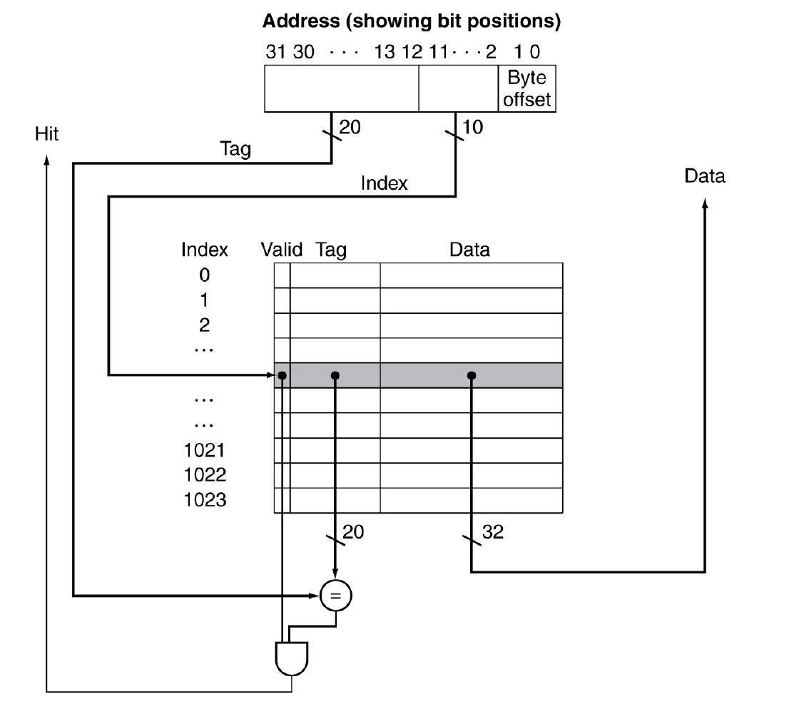

## 1. 메모리의 계층적 구조

폰노이만 아키텍쳐는 병목 현상이 필연적으로 발생할 수 밖에 없기에 이를 해결하고자 고안된 여러 방법 중 하나가 메모리 계층 구조이다.

메모리는 속도와 용량에 따라 피라미드 형태로 구성된다.

1. **레지스터 (Registers)**
   - CPU 내부에 위치
   - 가장 빠른 접근 속도
   - 매우 제한된 용량 (수 바이트~수백 바이트)
2. **캐시 메모리 (Cache)**
3. **메모리 (Main Memory, RAM)**
   - 캐시보다 훨씬 크지만 느림
   - 휘발성 메모리 (전원이 꺼지면 데이터 소멸)
4. **Storage**
   - SSD: 플래시 메모리 기반, 비휘발성, HDD보다 빠름
   - HDD: 자기 디스크 기반, 비휘발성, 큰 용량, 느림

메모리의 계층적인 구조가 효율적일 수 있는 이유는 Locality이다.

- Temporal locality : 내가 한 번 엑세스한 데이터는 조만간 또 엑세스할 가능성이 높은 데이터로, for문에 사용되는 명령어도 여기 속한다.
- Spatial locality : 메모리에 특정한 곳을 엑세스하면 주변에 엑세스할 가능성이 높은 데이터로 배열이 속한다.

메모리의 계층적인 구조의 핵심은 모든건 storage에 저장하고 최근에 방문한 데이터를 locality를 근거로 CPU에 가까운 메모리에 캐싱, 좀 더 최근에 방문한 데이터를 매우 빠른 캐시에 캐싱하는 것이다.

접근 과정도 생각해보면 어떤 데이터에 엑세스할 때 캐시에 있다면 히트가 나서 매우 빠르게 사용할 수 있고, 캐시에 없다면 미스가 나서 lower level 까지 가야 한다. 즉, 데이터에 엑세스하는 과정은 계층적인 메모리 구조에서 점점 low level 까지 내려가며 히트가 나는지 찾아보는 과정이다. 미스가 난다면 찾을 때까지 내려가야 하고 찾으면 upper level로 복사해오면서 locality를 지켜주게 된다.

---

## 2. 캐시 메모리

CPU와 램 사이에 캐시 메모리가 존재한다. 내가 원하는 데이터가 캐시에 존재하는지 안하는지 어떻게 알 수 있을까?

**Direct Mapped Cache**

→  0xabab같은 메모리 address를 캐시의 주소로 바꿔서 잘 배치하면 캐시에서 원하는 데이터를 잘 찾을 수 있다. 모듈러 연산을 활용한 해싱처럼 말이다.

그런데 캐시에 있는 데이터가 내가 원하는 데이터와 일치하는지 판단할 수 있는 근거가 필요하다. 피지컬한 주소를 캐시의 주소로 바꾸는 과정에서 주소의 일부만 떼오는 방식을 사용하기 때문이다.

이 문제때문에 태그를 사용한다. 10001 메모리주소를 찾는데 10001은 캐시에서 10이 태그, 001이 캐시 주소가 된다.

캐시에 01태그의 001주소에 값이 있고 10001 메모리 주소를 찾는 상황을 생각해보자. 캐시의 주소와 메모리 주소의 001이 일치하므로 태그를 본다. 태그가 기대했던 10과는 다르므로 lower level에서 찾아본다.

또, valid bit를 사용해서 해당 데이터가 유효한지 아닌지 기록해둔다.

이 방법의 문제는 다른 캐시가 비어있어도 끝이 같은 메모리끼리 경쟁한다는 것이다. 해싱과 같은 방법으로 해결할 수 있다.

