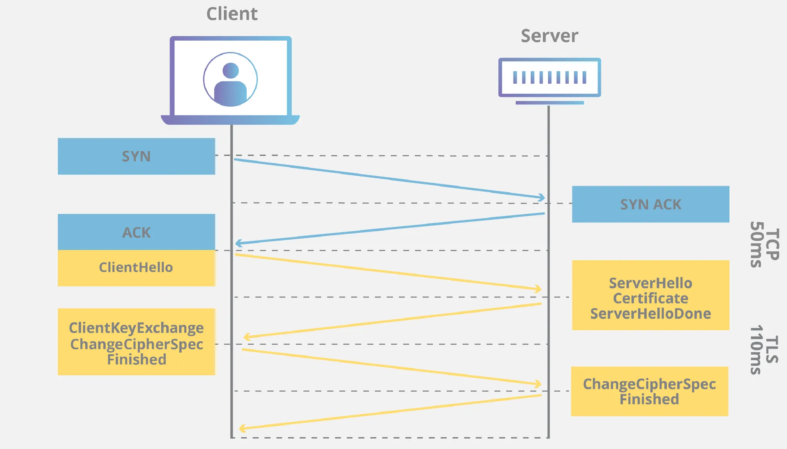

# HTTP 상태 코드와 HTTPS

## 1. HTTP 상태 코드

**2xx (성공, Success)**

- **200 OK**
- **201 Created**: 요청이 성공하여 새로운 리소스가 생성되었음을 의미

**3xx (리다이렉션, Redirection)**: 요청을 완료하기 위해 추가적인 조치가 필요함을 의미

- **301 Moved Permanently**: 요청한 페이지의 주소가 영구적으로 변경되었음을 나타냄
- **302 Found**: 일시적으로 다른 페이지로 이동하라는 의미

**4xx (클라이언트 오류, Client Error)**: 클라이언트 측의 실수로 요청을 처리할 수 없음을 의미

- **400 Bad Request**: 요청 자체가 잘못됨
- **401 Unauthorized**: 인증되지 않은 사용자의 요청 거부
- **403 Forbidden**: 인증은 되었지만, 해당 리소스에 접근할 권한이 없음을 의미
- **404 Not Found**: 요청한 페이지나 리소스를 서버에서 찾을 수 없을 때 발생

**5xx (서버 오류, Server Error)**: 서버 내부의 문제로 요청을 처리할 수 없음을 의미

- **500 Internal Server Error**: 서버 내부에 알 수 없는 오류가 발생했음을 나타냄
- **503 Service Unavailable**: 서버가 점검 중이거나 과부하로 인해 일시적으로 요청을 처리할 수 없음을 의미

---

## 2. HTTPS와 SSL/TLS

### 필요성

1. **암호화 (Encryption)**: 클라이언트와 서버가 주고받는 내용을 누군가 가로채도 알 수 없게끔 암호화한다.
2. **무결성 (Integrity)**: 데이터가 위조되거나 변조되지 않았음을 보장한다.
3. **인증 (Authentication)**: 접속하려는 사이트가 신뢰할 수 있는 사이트임을 증명하고 피싱 사이트로부터 사용자를 보호한다.

### SSL/TLS Handshake 과정

1. **Client Hello**: 클라이언트가 서버에 접속하며 자신이 사용할 수 있는 TLS 버전과 암호화 기술 목록을 서버에 보낸다.
2. **Server Hello**: 서버가 합의된 암호화 방식을 알리고, 공인된 인증서 (CA)를 함께 보낸다. 이 인증서 안에는 서버의 공개키가 포함된다.
3. **Client Verification & Key Exchange**: 클라이언트는 서버가 보낸 인증서가 신뢰할 수 있는 기관(CA)에서 발급된 것인지 확인한다. 확인이 끝나면, 앞으로 통신에 사용할 대칭키를 생성하여 서버의 공개키로 암호화한 뒤 서버에 보낸다.
4. **Server Decryption & Handshake Finish**: 서버는 자신만 가지고 있는 개인키로 암호화된 대칭키를 복호화한다. 즉, 클라이언트와 동일한 비밀키를 공유하게 되는 것이다.
5. **Secure Communication**: 이제 양측은 동일한 대칭키를 공유하게 되었으므로, 이 키를 이용해 모든 데이터를 암호화하여 안전하게 통신을 시작한다.

### 인증 (Authentication)

인증의 핵심은 신뢰할 수 있는 제3자인 인증 기관(Certificate Authority, CA)과 그들이 발급하는 **TLS 인증서이다.**

1. 웹사이트 운영자는 공인된 CA(예: Let's Encrypt)에 돈을 내고 신원을 검증받아, 사이트 정보와 공개키가 담긴 `TLS 인증서`를 발급받는다.
2. 사용자가 `google.com`에 접속하면, 구글 서버는 이 인증서를 웹 브라우저에 보낸다.
3. 웹 브라우저는 내장된 '신뢰할 수 있는 CA 목록'을 보고, 받은 인증서가 그중 한 곳에서 발급된 것인지, 그리고 CA의 서명이 위조되지 않았는지 확인한다.

### 암호화 (Encryption)

암호화의 핵심은 비대칭키(공개키/개인키)와 대칭키를 함께 사용하는 것이다.

1. **키 교환 (비대칭키 사용)**: 브라우저는 서버의 `TLS 인증서`를 통해 서버의 공개키를 확보한다. 그 후 실제 암호화에 사용할 대칭키를 새로 하나 만들고, 이 키를 서버의 공개키로 암호화해서 서버에 보낸다.
2. **서버의 복호화**: 서버는 공개키로 암호화된 이 메시지를 복호화한다. 이 과정을 통해 서버와 브라우저는 둘만 아는 비밀 대칭키를 안전하게 공유하게 된다.
3. **데이터 통신 (대칭키 사용)**: 이후 모든 실제 데이터는 이 공유된 대칭키를 이용한다.

### 무결성 (Integrity)

무결성의 핵심은 암호화할 때 사용했던 대칭키와 해시 함수를 이용해 만드는 메시지 인증 코드(MAC) 이다.

1. 서버가 클라이언트에게 “hello"라는 데이터를 보낸다고 가정해보자.
2. 서버는 "hello"라는 원본 데이터와 둘만 아는 대칭키를 해시 함수에 넣어 `A1B2C3`이라는 짧은 MAC 값을 생성한다.
3. 서버는 "hello"라는 원본 데이터와 `A1B2C3`이라는 MAC 값을 **함께** 클라이언트에게 보낸다.
4. 클라이언트는 받은 원본 데이터 "hello"와 자신이 가진 대칭키를 이용해 똑같이 MAC 값을 계산해 보고 변조 여부를 확인할 수 있다.
