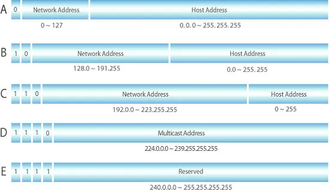

# IP와 NAT 그리고 ARP

## 1. Internet Protocol

IP 주소는 인터넷에 연결된 각 장치를 식별하기 위한 고유 주소이다. 그 중에서도 IPv4는 32bit로 구성되어 있고, 8bit씩 나누어 주소로 나타낸다.

### IP 주소의 구조

IP 주소는 크게 Network ID, Host ID로 나뉜다. 네트워크 ID는 장치들이 속한 네트워크를 나타내고, 호스트 ID는 그 네트워크 내에서 특정 장치를 가리킨다.

### 서브넷과 서브넷 마스크

네트워크 규모가 커지며 IP 주소를 효율적으로 사용할 필요성이 대두되었다.

서브네팅이 없는 IP를 생각해보면 위의 사진과 같다. 각 클래스별로 미리 경계를 정해놓고 주소별로 어떤 단체에 할당하는 방식이다.

- 예를 들어 생각해보자. 어떤 회사에서 500개의 IP 주소가 필요한 상황이다.
- C클래스 (254개)는 부족하다. 그렇다고 B클래스 (65,534)개를 할당받으면 약 65000개의 IP 주소가 낭비되며 IP 주소 고갈이 가속화될 것이다.

이러한 낭비를 해소할 수 있는 방법이 서브네팅이다. 서브네팅의 주요 효과는 다음과 같다.

1. 네트워크 성능 향상
   - 브로드캐스트 제어 : 네트워크에 있는 모든 장치에 한 번에 데이터를 보낼 수 있다. 서브네팅이 아니라면 브로드캐스트 시 엄청나게 많은 불필요한 트래픽이 유발된다.
   - IP 주소의 효율적 사용
2. 보안 강화
   - 네트워크 분리 : 한 서브넷에서 발생한 문제가 다른 서브넷으로 확산되는 것을 막음

서브네팅 구현의 핵심은 서브넷 마스크이다. 서브넷 마스크는 IP 주소를 보고 어디까지가 네트워크 주소이고 어디부터가 호스트 주소인지를 구분하는 역할을 한다.

서브넷 마스크에서 1로 채워진 부분은 네트워크 주소 부분을, 0으로 채워진 부분은 호스트 주소 부분을 나타낸다.

- 예를 들어 255.0.0.0과 같은 식인데, 이를 /8로 간단하게 표현할 수 있다. 192.168.1.100/24와 같은 방식이다.
  - 이러한 표기법을 CIDR 표기법이라 한다.

예시로 자세히 보자.

192.168.1.0/24를 두 개의 작은 네트워크로 나누고 싶다면 어떻게 해야 할까?

1. **비트 빌려오기**: 호스트 부분에서 비트를 빌려와 서브넷 부분으로 사용한다. 1비트를 빌려오면 2¹ = 2개의 서브넷을 만들 수 있습니다.
2. **서브넷 마스크 변경**: 기존 /24에서 1비트를 더해 /25가 된다.
   - /25의 서브넷 마스크: 255.255.255.128 (11111111.11111111.11111111.10000000)
3. **새로운 서브넷 생성**:
   - **첫 번째 서브넷**: 192.168.1.0/25 (사용 가능 IP: 192.168.1.1 ~ 192.168.1.126)
   - **두 번째 서브넷**: 192.168.1.128/25 (사용 가능 IP: 192.168.1.129 ~ 192.168.1.254)

### Localhost

`localhost`는 자기 자신을 가리키는 특별한 호스트 이름이다. 이는 주소 `127.0.0.1`로 변환되며, 루프백 주소라 한다.

- 내 컴퓨터 내부에서만 통신할 때 사용된다.
- `localhost`로 보내는 네트워크 요청은 외부 네트워크로 나가지 않고, 컴퓨터 내부의 네트워크 인터페이스에서 바로 처리된다.

주의할 점이 `0.0.0.0`은 모든 주소를 의미하며 보통 모든 IP 주소로부터 연결 허용을 설정할 때 사용한다.

- 예를 들어, 내 컴퓨터의 Wi-Fi IP가 `192.168.0.10`일 때 서버를 `0.0.0.0`으로 실행하면, 같은 Wi-Fi에 연결된 다른 기기에서 `http://192.168.0.10:포트번호`와 같은 주소로 접속할 수 있다.

---

## 2. IP의 범위 - 내부망? 공인IP?

**공인 IP (public IP)**

- 인터넷(WAN)에서 사용하는 전 세계적으로 유일한 IP 주소이다. 인터넷 서비스 제공업체 (ISP)로부터 할당받는다.

**사설 IP (private IP)**

- LAN 범위에서만 사용하는 IP 주소이다.
- 예를 들자면 아파트 단지 내에서만 통용되는 101동 501호와 같은 주소이다. 따라서 당연히 다른 네트워크와 중복될 수 있다.

그렇다면 인터넷은 어떻게 작동할까? 그 핵심 기술이 바로 NAT(Network Address Translation) 이다.

### NAT

1. 내부 기기가 인터넷으로 데이터를 보내려하면 공유기는 요청을 보낸 기기의 사설 IP를 ISP로부터 할당받은 공인 IP로 바꾼다.
2. 인터넷에서 응답이 돌아오면 공유기는 다시 공인 IP를 요청했던 사설 IP로 바꿔서 전달해준다.

---

## 3. ARP (Address Resolution Protocol)

ARP는 IP 주소를 MAC 주소로 바꿔주는 프로토콜이다. 네트워크에서는 IP 주소 + MAC 주소가 모두 필요한데, 이 둘을 연결해주는 역할이 바로 ARP이다.

### ARP의 동작 방식

컴퓨터 A가 같은 네트워크에 있는 컴퓨터 B에게 데이터를 보내려고 할 때, 다음과 같은 과정이 일어난다.

1. **ARP 캐시 확인**: 컴퓨터 A는 먼저 자신의 ARP 캐시(ARP 테이블)를 확인한다. 여기에 컴퓨터 B의 IP 주소에 해당하는 MAC 주소가 이미 저장되어 있는지 찾아본다.
   - **있는 경우 :** 바로 해당 MAC 주소를 사용해 데이터를 전송한다.
   - **없는 경우 :** 2번으로 가세요. \*\*\*\*
2. **ARP 요청 (Request)** : 컴퓨터 A는 네트워크에 있는 모든 장치에게 “컴퓨터 B의 IP를 가진 컴퓨터가 있다면 너의 MAC 주소를 알려줘” 라는 브로드캐스트 메시지를 보냅니다.
3. **ARP 응답 (Reply)** : 메시지를 받은 장치들은 자신의 IP 주소와 요청받은 IP 주소를 비교한다.
   - **주소가 다른 경우 :** 메시지를 무시한다.
   - **주소가 일치하는 경우 :** 컴퓨터 B가 자신의 MAC 주소가 담긴 유니캐스트 메시지를 컴퓨터 A에게만 보냅니다.
4. **ARP 캐시 등록 및 통신**: 컴퓨터 A는 전달받은 컴퓨터 B의 MAC 주소를 자신의 ARP 캐시에 기록하고, 이 MAC 주소를 이용해 데이터를 전송한다.
