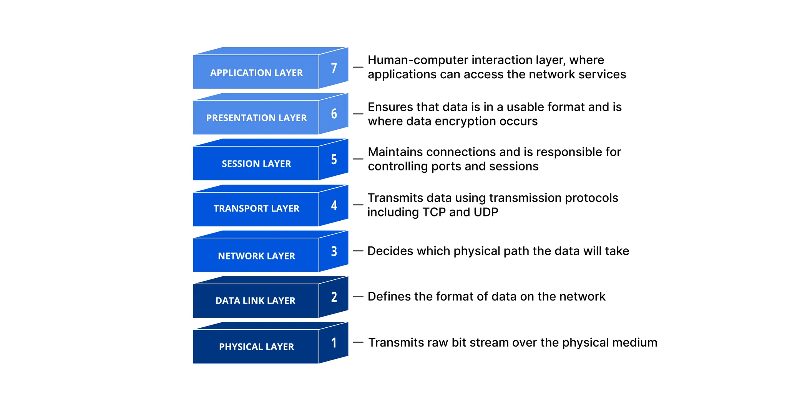

# OSI 7계층과 네트워크 기기

## 1. OSI 7계층

### 7계층 : 응용 계층

사용자가 네트워크에 접근하기 위한 인터페이스를 제공한다.

- 일반적인 HTTP 통신에 대한 인터페이스, DNS 같은 네트워크 접근에 대한 서비스 제공의 역할이다.

**프로토콜**

- HTTP, HTTPS : 웹 브라우저와 웹 서버의 통신에 대한 프로토콜이다.
- FTP : 파일을 주고받기 위한 프로토콜이다.
- DNS : 도메인 이름을 IP 주소로 변환하는 서비스이다.

---

### 6계층 : 표현 계층

응용 계층에서 받은 데이터를 모든 시스템이 이해할 수 있는 공통된 형식으로 변환하거나 그 반대의 역할을 수행한다.

**주요 기능 및 프로토콜**

- 인코딩을 통일시키는 데이터 형식 변환
- SSL/TLS가 동작하는 암호화 및 복호화
- 데이터 압축

응용 계층에서는 인코딩 등의 데이터의 구체적인 형식에 신경쓰지 않을 수 있어야 하고, 이를 위해 표현 계층이 동작한다.

- 예를 들어 응용 계층에서 카드 번호 등을 포함하는 결제 정보가 표현 계층에서 SSL/TLS 프로토콜을 통해 암호화되어 안전하게 전달되는 것이다.

---

### 5계층 : 세션 계층

양 끝단 응용 프로그램 간의 통신 세션을 설정, 관리, 동기화 및 종료하는 역할이다.

**주요 기능**

- 대화 제어 : 양방향 동시 통신인 Full Duplx, 교대로 통신하는 Half Duplex 등의 데이터 전송 방식을 결정한다.
- 동기화 : 파일 전송 시 중간에 오류가 발생하는 경우, Checkpoint 부터 재개할 수 있도록 동기화한다.
- 예를 들어 Zoom을 실행한다면 세션 계층에서 모든 참가자 간의 연결을 설정하고 유지한다. 만약 한 참가자의 연결이 끊기면 세션 계층에서 이 연결을 재개하여 회의에 다시 참여하도록 돕는다.

---

### 4계층 : 전송 계층

End-to-End의 신뢰성 있는 데이터 전송을 책임진다. 포트 번호를 사용하여 데이터가 올바른 프로세스에 전달되도록 하며, 데이터의 분할 및 재조립, 오류 제어, 흐름제어를 수행한다.

**주요 기능**

- Port Numbering
- 분할 및 재조립 : 상위 계층에서 받은 큰 데이터를 세그먼트 단위로 나누어 송신하고, 수신 측에서는 이를 다시 조립한다.
- 연결 제어, 흐름 제어, 오류 제어

**핵심 프로토콜**

- TCP, UDP : 추후 자세히 배워보자.

**PDU(데이터 단위)**

- 세그먼트 : 기존 큰 덩어리의 데이터를 세그멘트 단위로 분할한다.

---

### 3계층 : 네트워크 계층

데이터를 목적지까지 전달하기 위한 경로를 찾아내는 라우팅 역할을 한다. 서로 다른 네트워크 간 통신을 담당하며 논리적인 주소인 IP 주소를 사용한다.

**주요 기능**

- 라우팅 : 라우팅 테이블과 알고리즘을 사용하여 데이터 전송 경로 중 가장 효율적인 경로를 결정한다.
- 논리적 주소 지정 : 전체 네트워크에서 호스트를 식별하기 위한 IP 주소를 부여 및 관리한다.
  - 4계층에서 전달된 각 세그먼트에 IP 주소를 붙여 완성된 데이터 단위를 패킷이라 한다.

**핵심 프로토콜**

- IP : 신뢰성은 보장하지 않는다.
- ICMP : IP 패킷 전송 중 발생하는 오류를 보고한다.

**장비**

- 라우터

**PDU(데이터 단위)**

- 패킷 : 세그먼트 + IP 주소→ 패킷

---

### 2계층 : 데이터 링크 계층

동일한 LAN에 있는, 즉 물리적으로 직접 연결된 장치들 간 신뢰성 있는 데이터 전송을 담당한다. 물리 계층에서 발생할 수 있는 오류를 감지하고 수정한다.

**주요 기능**

- 물리적 주소 지정 : 데이터에 MAC 주소를 포함시켜 정확한 장치로 데이터가 전달되게 한다.
  - 즉, 동일한 LAN의 여러 컴퓨터와 장치를 동일하게 식별한다.
- 프레이밍 : 네트워크 계층에서 받은 패킷을 프레임 단위로 캡슐화한다. 원본 데이터로 해석하는 과정도 포함되어 있다.
- 오류 제어 : 오류 감지 및 경우에 따라 수정, 재전송을 요청한다. 주로 CRC를 사용한다.
- 흐름 제어 : 수신 측 처리 속도보다 송신 측이 더 빠르게 데이터를 보내지 않도록 조절한다.

**장비**

- 스위치, 브릿지

**PDU(데이터 단위)**

- 프레임

---

### 1계층 : 물리 계층

데이터를 raw bit stream으로 변환하여 실제 물리 전송 매체를 통해 전송하는 하드웨어적 측면을 다룬다.

**주요 기능**

- 비트 스트림 전송
- 물리적 명세 정의 : 케이블 종류, 핀 배열, 전압 레벨 등이다.

**핵심 개념**

- 데이터 단위 : 비트
- 전송 매체 : UTP 케이블, 광케이블 등

**장비**

- 허브, 리피터, 케이블, 모뎀

**PDU(데이터 단위)**

- 비트

---

## 2. TCP/IP 4계층

### 4계층 : 응용 계층

OSI 7계층의 세션, 표현, 응용 계층(5, 6, 7계층)을 통합한 계층이다. 사용자가 네트워크 서비스를 이용할 수 있도록 다양한 애플리케이션 프로토콜을 제공한다.

**주요 기능**

- 사용자에게 네트워크 서비스 인터페이스 제공
- 데이터 형식 변환 및 암호화

**주요 프로토콜**

- HTTP(s)
- FTP
- DNS

사용자가 웹 브라우저에 `www.google.com`을 입력했을 때, DNS 프로토콜이 IP 주소를 찾아주고 HTTP 프로토콜을 이용해 웹페이지를 요청하여 화면에 표시하는 과정이 4계층에 해당된다.

---

### 3계층 : 전송 계층

OSI 7계층의 전송 계층(4계층)에 해당된다. 최종 목적지 컴퓨터에서 실행되는 프로세스 간의 연결을 만들고 신뢰성 있는 데이터 전송을 보장한다.

**주요 기능**

- 프로세스 식별(Port Numbering)
- 데이터 분할 및 재조립 : 세그먼트 단위
- 흐름 제어 및 오류 제어

**프로토콜**

- TCP, UDP

**PDU**

- 세그먼트 (Segment) (TCP)
- 데이터그램 (Datagram) (UDP)

---

### 2계층 : 인터넷 계층

OSI 7계층의 3계층 : 네트워크 계층에 해당된다. 서로 다른 네트워크 간의 통신이 가능하도록 데이터의 전송 경로를 설정하고 제어한다.

**주요 기능**

- 경로 설정 (Routing): 데이터가 목적지까지 갈 최적의 경로를 결정합니다.
- 논리적 주소 지정: IP 주소를 사용하여 전체 네트워크에서 장치를 식별합니다.

**프로토콜**

- IP (Internet Protocol)
- ICMP

**PDU**

- 패킷

---

### 1계층 : 네트워크 인터페이스 계층

OSI 7계층의 물리 계층과 데이터 링크 계층에 해당된다. 물리적인 네트워크(LAN, Wi-Fi 등)를 통해 데이터를 실제로 전송하는 역할이다.

**주요 기능**

- 물리적 주소(MAC 주소) 지정
- 데이터의 전기 신호 또는 광신호 변환
- 같은 네트워크 내에서의 데이터 전송 및 오류 검출

**주요 프로토콜**

- 이더넷 (Ethernet), Wi-Fi, PPP

**PDU**

- 프레임

---

## 3. 네트워크 기기

### 라우터 (Router)

**동작 계층**

- 3계층 (네트워크 계층)

**동작 방식**

- 서로 다른 네트워크를 연결하는 장비이다.

1. 패킷(Packet)의 목적지 IP 주소를 확인한다.
2. 자신이 가진 라우팅 테이블을 보고 최적의 경로를 결정하여, 해당 경로로 패킷을 포워딩한다.

---

### 스위치 (Switch)

**동작 계층**

- 2계층 (데이터 링크 계층)

**동작 방식**

- 동일한 네트워크(LAN) 내에서 컴퓨터들을 연결하는 장비이다.

1. 들어온 데이터 프레임의 목적지 MAC 주소를 확인한다.
2. MAC 주소 테이블을 통해 해당 MAC 주소를 가진 장치가 어느 포트에 연결되어 있는지 보고, 목적지 포트로만 프레임을 전송한다.

---

### L3 스위치

위의 스위치는 2계층에서만 동작하는 L2 스위치이다. MAC 주소만 보고 동일 네트워크 내 스위칭 역할만을 담당했다면 L3 스위치는 빠른 스위칭과 네트워크 간 라우팅까지 담당하며 따라서 2, 3 계층 모두에서 동작한다.

**동작 방식**

- 기본적으로는 2계층 스위치처럼 MAC 주소를 기반으로 데이터를 처리한다.
- 하지만 서로 다른 네트워크 간의 통신이 필요할 때는 3계층 장비처럼 IP 주소를 읽고 경로를 설정(라우팅)하는 역할도 수행한다.

**L3 스위치 VS 라우터**

- L3 스위치는 하드웨어ASIC 칩를 기반으로 라우팅을 처리하여 속도가 매우 빠르다.
- 하지만 라우터는 소프트웨어 기반이기에 좀 더 느리지만 그만큼 NAT, 방화벽과 같은 복잡한 기능을 제공한다.
- L3 스위치는 주로 대규모 내부 네트워크(LAN)에서 VLAN 간의 통신이나 부서별 네트워크 간 빠른 데이터 교환을 위해 사용한다.
- 라우터는 내부 네트워크와 외부 인터넷(WAN)을 연결하는 관문 역할을 주로 담당합니다.

---

### 허브 (Hub)

**동작 계층**

- 1계층 (물리 계층)

**동작 방식**

- 스위치처럼 동일한 네트워크 내에서 컴퓨터들을 연결하지만, 훨씬 단순하게 동작한다.
- 한 포트에서 들어온 전기 신호(데이터)를 주소와 상관없이 모든 포트로 그대로 복사하여 전송한다. 이를 플러딩이라 한다.
- 모든 장치가 같은 데이터를 받기 때문에 충돌이 잦고 네트워크 효율이 떨어진다.

---

### 리피터 (Repeater) ⚡

**동작 계층**

- 1계층 (물리 계층)

**동작 방식**

- 거리가 멀어 약해진 전기 신호를 증폭시켜 더 먼 거리까지 데이터가 도달할 수 있도록 한다.
- 데이터 내용을 전혀 해석하지 않고, 오직 신호를 원래 세기로 재생성하고 재전송하는 역할만 수행한다.

---

### 게이트웨이 (Gateway) 🚪

**동작 계층**

- **모든 계층 (1~7계층)**

**동작 방식**

- 프로토콜이 전혀 다른 네트워크 간의 통신을 가능하게 하는 장비이다.
- 데이터를 받아서 다른 네트워크의 프로토콜에 맞게 데이터를 변환하고 번역해주는 역할을 한다.
- 예를 들어, 인터넷 공유기는 내부 네트워크(LAN)와 외부 인터넷망(WAN)을 연결해주는 일종의 게이트웨이이다.

---

### 랜카드 (NIC - Network Interface Card) 💻

**동작 계층**

- 1계층(물리) 및 2계층(데이터 링크)

**동작 방식**

- 컴퓨터를 네트워크에 물리적으로 연결해주는 하드웨어 부품이다.
- 1계층의 측면에서는 컴퓨터의 디지털 데이터를 케이블로 전송할 수 있는 전기 신호로 변환하는 역할이다.
- 2계층의 측면에서는 MAC 주소가 랜카드에 적혀있어 전세계적 네트워크상에서 컴퓨터를 식별할 수 있게 한다.
