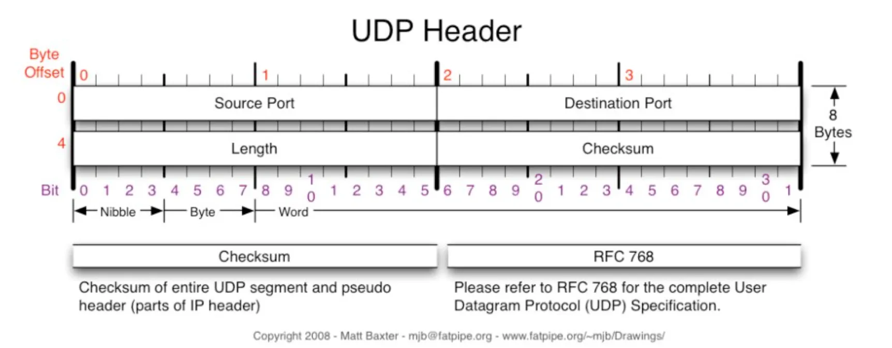

# TCP와 UDP

## 1. TCP

TCP (Transmission Control Protocol)은 OSI 4계층에서 동작하는 프로토콜로 어플리케이션 간 신뢰할 수 있는 데이터 전송을 보장한다.

**주요 특징**

- 연결 지향 : 데이터를 전송하기 전 3-way Handshake를 통해 논리적 연결을 설정한다.
- 신뢰성 있는 데이터 전송
  - 순서 보장 : 데이터 패킷이 뒤섞여 도착하더라도 수신측에서 올바르게 조립하여 전달한다.
  - 오류 제어 : 손실, 손상된 패킷을 감지하여 재전송한다.
  - 흐름 제어 : 송신자가 수신자의 처리 속도보다 빠르게 데이터를 보내는 것을 방지한다. 윈도우 크기를 통해 수신 가능한 버퍼 용량을 송신자에게 알려주는 방식이다.
  - 혼잡 제어 : 혼잡을 감지하여 데이터 전송량을 조절한다.

### TCP 구조와 신뢰성 메커니즘

TCP에서는 데이터를 세그먼트 단위로 전송하며, 각 세그먼트의 헤더에는 다음과 같은 중요 정보가 포함되어 있다.

- 순서 번호 : 이를 통해 데이터를 재조립할 수 있다.
- 확인 응답 번호 : 수신 측이 다음에 받아야 할 데이터의 순서 번호이다.
- 윈도우 크기 : 수신측이 한 번에 받을 수 있는 데이터의 양이며 이를 통해 흐름 제어를 할 수 있다.
- 체크섬 : 오류 검출을 위한 값이다.

**순서 보장**

- 데이터는 네트워크를 통해 여러 경로로 전송되므로 도착 순서가 뒤섞일 수 있다.
- 송신측은 각 데이터 세그먼트에 순서 번호를 전송한다.
- 수신측은 이 순서 번호를 보고 뒤섞인 세그먼트를 올바른 순서로 재조립할 수 있다.

**오류 제어**

- 네트워크 전송 중 데이터가 손상되거나 유실되는 경우 체크섬, ACK, 재전송 타이머를 조합하여 데이터의 무결성을 보장한다.
- 오류 검출의 경우 체크섬을 계산하여 값이 다르다면 손상된 데이터로 판단하여 해당 세그먼트를 폐기한다.
- **피드백 및 재전송 과정**
  - 수신 측은 데이터를 성공적으로 받으면, 다음에 받아야 할 데이터 순서 번호를 ACK에 담아 송신 측에 전달한다.
  - 송신 측은 특정 시간 동안 ACK를 받지 못해 재전송 타이머가 만료되면 데이터가 유실되었다 판단하여 세그먼트를 재전송한다.
  - 또한, 특정 세그먼트에 대해 ACK는 오지 않았는데, 후속 세그먼트에 대한 ACK 응답이 중복해서 오는 경우 빠른 재전송 메커니즘을 가지고 있다.
    - TCP의 수신자는 특정 세그먼트가 도착하지 않으면 송신자에게 해당 세그먼트에 대한 ACK를 계속 알린다.
    - 수신측은 이런 경우 타이머 만료를 기다리지 않고 특정 세그먼트에 대한 유실을 확정하여 다시 보내게 된다.

**흐름 제어**

- 윈도우 크기를 사용하여 데이터 전송량을 조절하는 슬라이딩 윈도우 메커니즘으로 전송 속도를 조절한다.
- 수신 측은 자신의 현재 버퍼 여유 공간을 윈도우 크기 필드에 담아 송신 측에 알린다.
- 송신 측은 수신 측이 알려준 윈도우 크기만큼 ACK 없이도 데이터를 전송한다.

**혼잡 제어**

- 흐름 제어가 송신자와 수신자 간의 속도 차이를 조절하는 것이라면, 혼잡 제어는 네트워크 전체의 상태를 고려하여 데이터 전송량을 조절하는 메커니즘이다.
- TCP는 ACK 수신 여부와 패킷 유실 감지를 통해 네트워크의 혼잡 상태를 추론하고, 자체적으로 혼잡 윈도우 값을 관리하여 전송량을 조절한다
  - 느린 시작 (Slow Start): 연결 초기에는 혼잡 윈도우 값을 작은 값으로 시작하여, ACK를 받을 때마다 혼잡 윈도우 값을 지수적으로 증가시켜 빠르게 전송량을 늘린다.
  - 혼잡 회피 (Congestion Avoidance): 혼잡 윈도우 값이 threshold에 도달하면, 기존 지수적으로 증가하던 값을 선형적으로 증가시킨다.
  - 혼잡 감지 (Congestion Detection): 재전송 타이머가 만료되거나 3개의 중복 ACK가 수신되면 네트워크 혼잡으로 간주하고, 혼잡 윈도우 값을 크기를 대폭 줄인다.

이때 헷갈리는 개념이 수신 윈도우와 혼잡 윈도우이다.

수신 윈도우는 흐름 제어의 관점에서 수신자가 송신자에게 값을 지정해 보낸다.

반면, 혼잡 윈도우는 혼잡 제어의 관점에서 송신자가 자체적으로 판단하여 전송량을 조절한다.

실제 최종 전송량은 두 윈도우 중 최소값으로 정해진다.

---

## 2. UDP

UDP(User Datagram Protocol) 또한 OSI 4 계층에서 동작하며, 신뢰성보다 속도에 강점이 있는 프로토콜이다.

**주요 특징**

- 비연결성 : TCP처럼 데이터를 보내기 전 연결 setup이 존재하지 않는다. 보내고 싶을 때 일방적으로 데이터를 전송하는 방식이다.
- 비신뢰성 : 보낸 데이터가 제대로 도착했는지, 순서는 올바른지 등을 확인하지 않는다. 따라서 흐름 제어나 혼잡 제어 기능도 존재하지 않아 네트워크 상황을 고려하지 않는다.
- 연결 설정 혹은 각종 제어 메커니즘이 없기에 TCP에 비해 헤더가 단순하고 데이터 처리 속도가 매우 빠르다.
- 데이터그램 방식: 각각의 데이터그램이 독립적으로 전송된다. 따라서 전송 순서가 보장되지 않으며, 중간에 유실될 수 있다.

**주요 매커니즘**

UDP는 TCP의 복잡한 제어 메커니즘을 대부분 가지지 않으며 정말 최소한의 기능만을 가지고 있다.

- 연결 및 상태 관리 없음
- 체크섬 필드를 통해 오류 검출만 가능. 오류가 발견되어도 재전송 요청 메커니즘은 존재하지 않으며 해당 데이터그램은 그냥 폐기 처리
- 재전송, 순서 재조합 없음

### UDP 데이터그램 구조

- 송신 포트 : 데이터를 보내는 애플리케이션의 포트 번호.
- 수신 포트 : 데이터를 받는 애플리케이션의 포트 번호.
- 길이 : UDP 헤더 + 데이터를 합친 길이
- 체크섬

신뢰성이 떨어짐에도 UDP가 널리 사용되는 이유는 속도가 매우 중요하고, 데이터 일부가 유실되어도 큰 문제가 없는 서비스에 적합하기 때문이다.

- 실시간 스트리밍: 동영상이나 음악 스트리밍 시 약간의 화질 저하나 음질 끊김이 있더라도, 실시간으로 계속 재생하는 것이 더 중요하다.
- 온라인 게임: 지연 시간이 승패를 가르기 때문에 신뢰성보다 속도가 우선된다.
- DNS : 도메인 이름을 IP 주소로 변환하는 과정은 매우 빠른 응답이 필요하다.

### UDP와 HTTP/3

요즘에는 HTTP/3가 나오면서 UDP가 주목을 받는다. 사실 UDP 기반의 QUIC 프로토콜을 사용하는 것이긴 하지만, 왜 TCP를 버리고 UDP 기반의 프로토콜을 만들어서 사용할까?

기존의 HTTP/2.0은 여러 데이터를 하나의 TCP 연결로 멀티플렉싱하여 처리하는 방식으로 속도를 높였다. 하지만 Head-of-Line Blocking 문제는 근본적으로 해결할 수 없었고 한계점이 분명했다.

그 전에! TCP의 HoL은 굉장히 전형적인 문제이고 모두가 알고 있는 문제였다. 그렇다면 그 전에 이를 해결하려던 시도들은 없었을까?

- **HTTP/1.1:** 한 번에 하나의 요청만 처리하는 문제를 해결하기 위해, 브라우저가 여러 개의 TCP 연결을 동시에 만드는 방식을 사용했다. 하지만 연결마다 핸드셰이크를 해야 해서 리소스 낭비가 심했다.
- **HTTP/2:** 이 문제를 해결하기 위해 멀티플렉싱을 도입하여 하나의 TCP 연결 안에서 여러 데이터를 동시에 처리하는 기술을 도입했다. 하지만 결국에는 전송 계층의 TCP 프로토콜은 그대로 둔 채 어플리케이션 계층의 HTTP를 발전시킨 것이기에 하나의 TCP를 사용하는 것이고, HoL의 문제는 여전했다.
- 정리하자면, 아무리 어떤 똑똑한 발전들로 HTTP를 발전시켜고 TCP 자체가 구식이기에 한계점이 존재하는 것이다.

**Head-of-Line Blocking**

- TCP는 데이터의 순서를 철저히 보장한다. 만약 1, 2, 3번 패킷을 보내는데 2번 패킷이 중간에 유실되면, TCP는 2번 패킷이 재전송되어 도착할 때까지 이미 도착한 3번 패킷을 처리하지 않고 전체 라인을 멈춘채 대기한다.
- 웹페이지에서 여러 이미지(A, B, C)를 다운받을 때, 이미지 A의 데이터 조각 하나가 유실되면 멀쩡하게 도착한 이미지 B, C의 데이터도 처리가 지연되는 문제가 발생하는 것이다.

**QUIC**

- QUIC은 UDP 위에서 동작하기 때문에 TCP의 엄격한 순서 보장 규칙에 얽매이지 않는다. 대신 QUIC 자체적으로 '스트림'이라는 독립적인 데이터 통로를 여러 개 만듭니다.
- 따라서 만약 이미지 A를 전송하는 스트림에서 패킷 유실이 발생해도, 이미지 B, C를 전송하는 다른 스트림에는 영향을 주지 않고 계속해서 데이터를 처리할 수 있게 된 것이다.

그 뿐 아니다. TCP는 3-way handshake + 암호화 통신을 위한 TLS handshake 과정 때문에 set up 시간이 너무 길다. 반면, QUIC는 두 과정을 통합하여 첫 연결 시 set up time을 획기적으로 줄였다. 심지어 한 번 연결했던 서버와 다시 연결할 때는 이 과정을 거의 생략할 수 있다.

조금 더 자세히 보자면 QUIC는 1-RTT, 최초 연결 시 단 1번의 왕복으로 연결과 암호화 설정을 모두 끝낼 수 있다.

- 1-RTT : 클라이언트가 서버에 연결 요청을 보내면, 이 첫 패킷에 연결에 필요한 정보와 암호화 설정을 위한 정보를 모두 담아 보낸다. 서버는 이 패킷을 받고 응답하면서 연결과 암호화 설정이 완료된다.

---

## 3. TCP handshakes

### 연결 설정 : 3-way handshakes

- **1단계: SYN (클라이언트 → 서버)**
  - 패킷에는 클라이언트가 사용할 임의의 초기 순서 번호가 포함된다.
- **2단계: SYN + ACK (서버 → 클라이언트)**
  - SYN 패킷을 받은 서버는 통신을 수락한다는 의미로 ACK + SYN 응답을 보낸다.
  - **ACK**: "네가 보낸 순서 번호+1을 보낼게" (요청 잘 받았다는 의미)
  - **SYN**: "이건 내가 사용할 초기 순서 번호야" (자신의 통신 시작을 알림)
- **3단계: ACK (클라이언트 → 서버)**
  - 서버가 보낸 순서 번호+1의 값으로 ACK를 보낸다.

### 4-way Handshake (연결 해제)

- **1단계: FIN (클라이언트 → 서버)**
  - 클라이언트가 FIN 패킷을 보내 연결 해제를 요청한다.
- **2단계: ACK (서버 → 클라이언트)**
  - FIN 패킷을 받은 서버는 아직 전송 중이던 데이터가 존재하므로 “연결 해제는 보내던거 다 보내고 할게” 라는 의미로 ACK 보내고 남은 데이터를 모두 전송한다.
- **3단계: FIN (서버 → 클라이언트)**
  - 남은 데이터를 모두 전송한 서버는 연결 해제 준비 완료의 의미로 FIN 패킷을 클라이언트에게 보낸다.
- **4단계: ACK (클라이언트 → 서버)**
  - 서버의 FIN 패킷을 받은 클라이언트는 마지막 **ACK** 패킷을 보낸다. 이 ACK를 받은 서버는 즉시 연결을 닫는다.
  - 클라이언트는 혹시 모를 네트워크상의 지연 패킷을 처리하기 위해 잠시 대기한 후 연결을 완전히 닫습니다.

연결 해제는 4단계인 이유는 클라이언트의 FIN 신호에 대해 서버가 즉시 연결을 종료할 수 없기 때문이다. 그렇다고 FIN 신호를 무시해버리면 유실이라 생각할 수 있기에 일단 알았다는 의미로 ACK를 먼저 보낸다. 그래서 ACK, FIN을 분리한 4-way handshake가 되는 것이다.

### 피기배킹

기본적으로는 데이터를 받은 쪽이 ACK를 보내야 한다. 하지만 실제로는 효율을 위해 피기배킹이라는 방식을 사용한다.

피기배킹은 내가 상대방에게 데이터를 보낼 때 이전에 받았던 데이터에 대한 ACK를 그 데이터 패킷에 덧붙여 한 번에 보내는 기술이다. piggyback은 목마를 태우다라는 뜻인데, 똑같이 데이터에 ACK를 목마 태워 보내는 것이다.

**예시**

1. A → B 데이터 전송. SEQ=1. 100 바이트 전송
2. 실제로 B는 SEQ 1은 잘 받았고 101부터 줘 라는 의미로 ACK(101)을 보내야 한다.
3. 이때 B도 A에게 보낼 데이터 200바이트가 존재한다면 원래대로는 ACK 따로, 데이터를 따로 보내야 한다.
4. 여기서 피기배킹을 사용하면 B는 자신의 데이터(200바이트) 패킷에 ACK(101) 정보를 포함시켜 한 번에 보내게 된다.s
